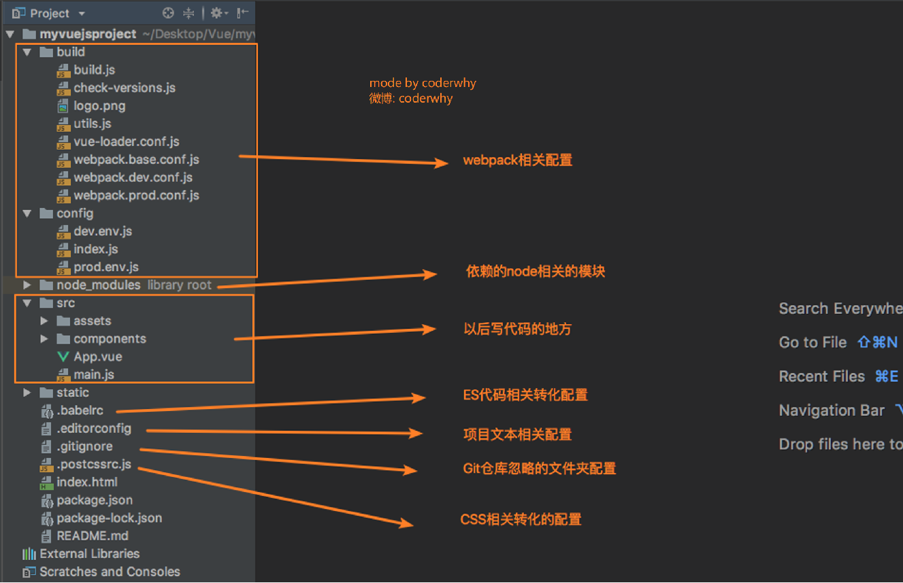
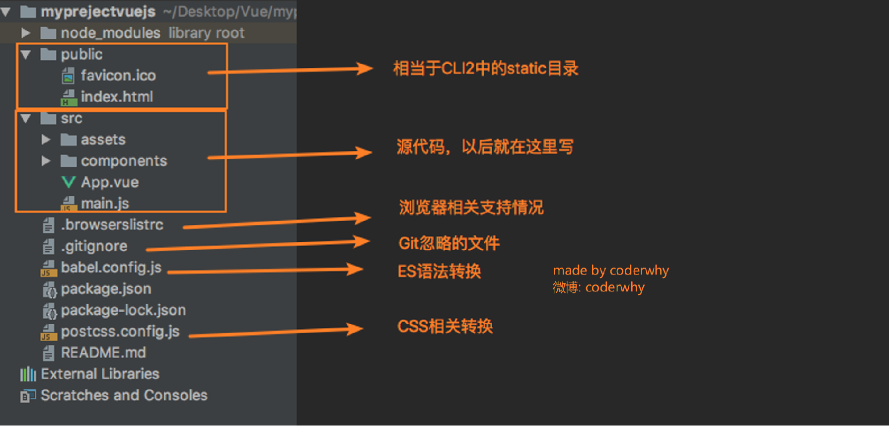

# Vue CLI

### 1、什么是Vue CLI

Vue-CLI是Vue.js的脚手架，用于自动生成vue.js+webpack的项目模板。


### 2、什么是CLI

- CLI是Command-Line Interface,命令行界面，俗称脚手架。
- Vue CLI是官方发布的Vue.js项目脚手架
- 我们可以使用Vue CLI快速搭建Vue开发环境以及对应的webpack配置。


### 3、Vue CLI的安装并使用

- 安装Vue脚手架

  Vue CLI4的安装方法：

  ```
  npm install -g @vue/cli
  #OR
  yarn global add @vue/cli
  ```

  安装完成后检查是否安装成功及版本号：

  ```
  vue --version
  ```

  如需升级全局Vue CLI包：

  ```
  npm update -g @vue/cli
  #OR
  yarn global upgrede --latest @vue/cli
  ```

  >如果安装CLI失败，采用以下两种方法解决
  >
  >1.以管理员身份启动cmd
  >
  >2.删除npm-cache缓存，文件位置在C盘APPData中。

- 初始化项目

  - Vue CIL2初始化项目

    ```
    vue init webpack 项目名
    ```

  - Vue CIL3/CIL4初始化项目

    ```
    vue create 项目名
    ```

  - 拉取2.x模板（旧版本）

    Vue CLI >= 3 和旧版使用了相同的 `vue` 命令，所以 Vue CLI 2 (`vue-cli`) 被覆盖了。如果你仍然需要使用旧版本的 `vue init` 功能，你可以全局安装一个桥接工具：

    ```
    npm install -g @vue/cli-init
    # `vue init` 的运行效果将会跟 `vue-cli@2.x` 相同
    vue init webpack my-project
    ```

- 选择创建项目的选项

  各个选项的含义如下：

  - project name：项目名字（默认）

  - project description：项目描述

  - author：作者（会默认拉去git的配置）

  - vue build：vue构建时候使用的模式

    - runtime+compiler：大多数人使用的，可以编译template模板
    - runtime-only：比compiler模式要少6kb，并且效率更高，直接使用render函数

  - install vue-router：是否安装vue路由

  - user eslint to lint your code：是否使用ES规范

  - set up unit tests：是否使用unit测试

  - setup e2e tests with nightwatch：是否使用end 2 end，点到点自动化测试

  - Should we run `npm install` for you after the project has been created? (recommended)：使用npm还是yarn管理工具

    >注意：如果创建工程时候选择了使用ESLint规范，又不想使用了，需要在config文件夹下的index.js文件中找到useEslint，并改成false。

    ```
      // Use Eslint Loader?
        // If true, your code will be linted during bundling and
        // linting errors and warnings will be shown in the console.
        useEslint: true,
    ```


### 4、Vue CLI使用详解

#### 4-1 目录结构详解

创建完成后，目录如图所示：



其中build和config都是配置相关的文件。


#### 4-2 package.json中~和^的区别

- ~指定版本：比如 "babel-plugin-import": "~1.1.0",表示安装1.1.x的最新版本（不低于1.1.0），但是不安装1.2.x，也就是说安装时不改变大版本号和次要版本号

- ^指定版本：比如 "antd": "^3.1.4",，表示安装3.1.4及以上的版本，但是不安装4.0.0，。 


#### 4-3 package.json与package-lock.json的区别

- package.json 是生成的系统库的大概版本号


- package-lock.json 是生成的系统当前安装的库的具体来源和版本号，锁定版本。


#### 4-4 runtime-compiler和runtime-only的区别

- compiler编译解析template的过程：

  template解析成ast抽象语法树，抽象语法树编译成render函数。render函数最终将template解析的抽象语法树渲染成虚拟DOM，最终虚拟DOM映射到UI上。

- only编译的过程：

  render函数直接渲染成虚拟DOM并映射到UI。

  render->virtual dom->UI

- 综上 runtime-only 性能更高、代码量更少。开发项目使用runtimeonly。


#### 4-5 render函数

```
new Vue({
  el: '#app',
  render: function (createElement) {
    //1、普通用法：createElement('标签',{标签的属性},['标签内的内容'])
    //替换掉el中挂载的东西
    //return createElement('h2',
    //     { class: 'box' },
    //     ['hello,world', createElement('button', ['按钮'])]);

    // 2、传入一个组件对象
    return createElement(App);
  }

})
```


### 5、 Vue CLI3使用

**vue-cli3与2版本区别**

- vue-cli3基于webpack4打造，vue-cli2是基于webpack3
- vue-cli3的设计原则是"0配置"，移除了配置文件，build和config等
- vue-cli3提供`vue ui`的命令，提供了可视化配置
- 移除了static文件夹，新增了public文件夹，并将index.html移入了public文件夹

**vue cli3创建项目**

```
vue create 项目名
```

**目录结构：**



**vue3使用npm run serve运行服务器**

```
//main.js代码
import Vue from 'vue'
import App from './App.vue'

Vue.config.productionTip = false

new Vue({
  render: h => h(App),
}).$mount('#app')

```

如果vue实例有el选项，vue内部会自动给你执行`$mount('#app')`，如果没有需要自己执行。

#### 5-1 Vue CIL3配置

使用`vue ui`命令进入图形化界面创建项目，可以以可视化的方式创建项目，并配置项。

**如何要自定义配置文件**

在项目根目录下新建一个`vue.config.js`配置文件，必须为`vue.config.js`，vue-cli3会自动扫描此文件，在此文件中修改配置文件。

```
//在module.exports中修改配置
module.exports = {
  
}
```

 