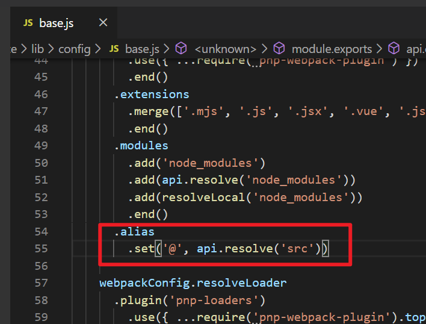

# Vue router

## 1 认识路由

### 1.1 什么是路由

- 路由是通过互联的网络把信息从源地址传输到目的地址的活动

- 路由器提供两种机制：路由和传送

  - 决定数据包从来源到目的地的路径
  - 转送就是将数据转移

- 路由表

  本质是映射表，决定数据包的指向。

### 1.2 前后端路由

1. 什么是后端路由

   浏览器发送请求url，由后端处理url与页面的映射关系，服务器渲染好整个页面后返回给浏览器进行显示。

   缺点：

   - 前后端没有分离，责任划分不明确。
   - 编写和维护麻烦。

2. 前端路由

   - 前端路由诞生背景：前后端分离 （通过ajax请求数据）后端只负责提供数据，前端负责交互和可视化，使前后单责任明确。
   - 前端路由的核心：
     - 改变url，页面不进行整体刷新

3. 单页面富应用SPA (single page application)

   - SPA主要特点：前后端分离+前端路由

### 1.3 前端路由的规则

#### 1.3.1 URL的hash

- URL的hash就是锚点（#），本质上是改变window.locatin的href
- 通过直接赋值location.hash来改变href, 但是页面不发生刷新

#### 1.3.2 HTML5的history模式

history接口有五种模式改变url而不刷新页面。

**history.pushState()**

- 使用方法：history.pushState({},'','home')
- 使用history.back()可回退，使用history.forward()可前进，类似栈结构。

**history.replaceState()**

- 使用方法：history.replaceState({},'','home')
- 不能返回

**history.go()**

- 参数正数前进，负数后退，大小为步数。
- history.back()等于history.go(-1)。history.forward()等于history.go(1)。


## 2 vue-router

- vue-router是基于路由和组件的
  - 路由用于设计访问路径，将路径和组件映射起来。
  - 在vue-router的单页面应用中，页面的路径的改变就是组件的切换。

### 2.1 Vue-router的安装配置

1. 使用npm install vue-router --save安装vue-router插件模块。

2. 若创建Vue项目选择了vue-router  y，可在模块化工程中使用它，需要在src/router/index.js中配置路由映射关系。

   >vue-router的index.js配置解析
   >
   >```
   >//配置路由相关信息
   >import Router from "vue-router"
   >import Vue from "vue"
   >
   >// 1、通过Vue.use(插件)，安装插件
   >Vue.use(Router);
   >
   >// 2、创建Router对象
   >const routes = [
   >
   >]
   >const router = new Router({
   >  //配置路由和组件之间的映射关系
   >  routes
   >})
   >
   >// 3、将Router对象挂载到vue实例中 需要导出
   >export default router
   >```

### 2.2 Vue-router的使用

#### 2.2.1 Vue-router的使用步骤

1. 创建路由组件

2. 在src/router/index.js中配置组件和路径的映射关系

   ```js
   //配置路由相关信息
   import Router from "vue-router"
   import Vue from "vue"
   
   // 1、通过Vue.use(插件)，安装插件
   Vue.use(Router);
   
   // 2、创建Router对象
   const routes = [
   
   ]
   const router = new Router({
     //配置路由和组件之间的映射关系
     routes
   })
   
   // 3、将Router对象挂载到vue实例中 需要导出
   export default router
   ```

   如果是手动配置router，还需要在main.js中添加：

   

3. 在组件中路由，通过<router-link><router-view>。

   <router-link>默认会渲染成a标签

   ```js
   //App.vue
   <template>
     <div id="app">
       <router-link to="/home">首页</router-link>
       <router-link to="/about">关于</router-link>
       <!-- router-view相当于占位符 -->
       <router-view></router-view>
     </div>
   </template>
   ```

#### 2.2.2 Vue-router使用细节处理

##### 路由默认路径

路由的默认路径，想实现用户进入页面，路径自动跳转至首页。

配置：在routes中多配置一个映射。

```
routes: [
    {
      path: '',
      // 重定向，让路径默认跳到首页
      redirect: '/home'
    },
	...
 ]
```

##### 改变路径模式

改变路径且不产生刷新有两 种方法：

- URL的hash
- HTML5的history

vue-router默认使用改变URL的hash，但这样会在路径前显示"#"，不美观。如果想使用history模式，则配置：

```js
export default new Router({
  routes: [...],
  mode: "history"
})

```

添加mode，设置模式为history 

##### router-link的其他属性

router-link除了 **to 属性**，用于指定跳转路径，还有其他的一些常用属性：

- tag：属性值为标签名，指定router-link渲染成什么组件，不指定则默认为a。

- replace：不用属性值，指定不留下history记录。

- active-class：属性值为路由匹配元素class名，指定路由匹配元素class名，不指定则默认为router-link-active。

  >若直接在router-link添加active-class，每一个都要添加，不方便。
  >
  >简便方法，在router中配置 linkActiveClass:'xxx'
  >
  >```
  >export default new Router({
  >  routes: [...],
  >  linkActiveClass: 'active'
  >})
  >```

##### 路由代码跳转

```html
//App.vue
<template>
  <div id="app">
    <div @click="indexClick">首页</div>
    <div @click="aboutClick">关于</div>
    <!-- router-view相当于占位符 -->
    <router-view></router-view>
  </div>
</template>

<script>
export default {
  name: "App",
  methods: {
    indexClick() {
      // $router为vue-router给每个组件都封装好的属性,可以this.$router进行获取。
      // 如果连续点击会报错，此时在后面使用.catch(err => err)
      // this.$router.push("/home").catch(err => err);
      this.$router.replace("/home").catch(err => err);
      console.log("index");
    },
    aboutClick() {
      // this.$router.push("/about").catch(err => err);
      this.$router.replace("/about").catch(err => err);
      console.log("about");
    }
  }
};
```

### 2.3 动态路由

某些情况下，path路径不确定，例如/user/zhangsan，后者为用户ID

这种path与Component的匹配关系，称为动态路由，让路由传递数据。

#### 2.3.1 动态路由的使用

1. 创建希望数据为动态的Vue组件 `User.vue`

2. 在routes中配置路径与组件的映射关系

   ```js
   {
      path: '/user/:userId',
      component: User
   }
   ```

3. App.vue中使用router-link，其中to属性为绑定属性

   ```html
   <router-link :to="'/user/'+userId">我的</router-link>
   ```

4. 在`User.vue`中展示动态数据

   使用`this.$route`获取当前活跃的路由，使用`this.$route.params.xxx`获取路由传递过来的xxx数据。

   >在方法中需要this，在模板的mastache中直接$route.params.xxx

### 2.4 嵌套路由

需求：/home/news和/home/message访问不同的内容。

即一个路径映射一个组件，访问这两个路径也会分别渲染两个组件。

**实现嵌套路由的步骤**

1. 定义组件。

2. 在routes中配置映射关系。注意是在映射关系中增加属性children，其属性值同样为数组。

   

3. 在Home组件中使用router-link 和router-view

### 2.5 路由懒加载

#### 2.5.1 不使用懒加载

不使用懒加载，最后打包js有3个文件：app.xxx.js、vendor.xxx.js、mainfest.xxx.js。当项目越来越大，app包会越来越大，一次性从服务器请求下来会花费一些时间，导致用户界面白屏，对用户不友好。

#### 2.5.2 使用懒加载

懒加载方式：

1. 结合Vue的异步组件和Webpack的代码分析. **知道是懒加载即可，不用会写**

   ```js
   const Home = resolve => { require.ensure(['../components/Home.vue'], () => { resolve(require('../components/Home.vue')) })};
   ```

2. AMD写法

   ```js
   const About = resolve => require(['../components/About.vue'], resolve);
   ```

3. ES6写法 **推荐★★★★★**

   ```js
   const Home = () => import('../components/Home')
   ```

   ```js
   import Vue from 'vue'
   import Router from 'vue-router'
   const Home = () => import('../components/Home')
   const About = () => import('../components/About')
   const User = () => import('../components/User')
   Vue.use(Router)
   export default new Router({
     routes: [
       {
         path: '',
         // 重定向，让路径默认跳到首页
         redirect: '/home'
       },
       {
         path: '/home',
         component: Home
       },
       {
         path: '/about',
         component: About
       },
       {
         path: '/user/:userId',
         component: User
       }
     ],
     mode: 'history',
     linkActiveClass: 'myactive'
   })
   
   ```

使用`npm run build`命令将之前创建的项目打包，打开dist文件夹，器目录结构如下：


- app.xxx.js是我们自己编写的业务代码
- vendor.xxx.js是第三方框架，例如vue/vue-router/axios等
- mainfest.xxx.js是为了打包的代码做底层支持的，一般是webpack帮我们做一些事情
- 其他数字.xxx.js为组件对应的js，每个懒加载的组件对应一个js。

### 2.6 路由传递参数

#### 2.6.1 传递参数的方式

1. params

   - 类型

     - route中配置路由格式：

       ```js
       path:'/user/:userid'
       ```

     - 传递方式：在path后跟上对应的值。

     - 传递后形成的路径：/user/ruoruochen

2. query

   - 类型

     - router中配置路由格式：(普通配置)

       ```js
       path:'/user'
       ```

     - 传递方式：在对象中使用query。

       1. 在router-link中的to中使用

          ```js
          <router-link :to="{
                path:'/profile',
                query:{userId:'ruoruochen',age:18} 
              }">档案</router-link>
          ```

       2. 在js代码中使用

          ```html
          <button @click="profileClick">档案</button>
          
          profileClick() {
                this.$router.push({
                  path: "/profile",
                  query: {
                    userId: "ruoruochen",
                    age: 18
                  }
                });
              }
          ```

          

     - 传递后形成的路径：/user?userid=ruoruochen

**params和query如何选择？**

单个数据都可以使用。

大量数据推荐使用query。

#### 2.6.2 (扩展)$route和$router的区别

- $route获取当前活跃的路由，可以获取query、params等。
- $router获取VueRouter实例，想要导航到不同URL，使用$router.push()

###  2.7 导航守卫

需求：点击不同的标签，显示不同的标题。

普通的修改方法：

- 在每一个路由对应的组件.vue中，通过mounted声明周期函数，执行document.title="xxx"。
- 缺点：当页面较多时，需要打开许多的.vue添加mounted函数进行修改。

好的方法：使用导航守卫进行监听并修改。


需求：用户token被清除，不管在后台的哪个页面，自动跳转至登录页

#### 2.7.1 什么是导航守卫？

- 监听路由的进入和离开
- vue-router提供了beforeEach和afterEach的钩子函数，在路由改变前后触发。

#### 2.7.2 导航守卫的使用

**导航钩子三个参数的解析**

1. to：即将要进入的目标路由对象
2. from：当前导航即将离开的路由对象
3. next：调用该方法后，才能进入下一个钩子

**导航守卫的使用**

1. 在routes配置中，给各自路由添加meta属性，设置标题名称。

   ```js
       {
         path: '/about',
         component: About,
         meta: {
           title: '关于'
         }
       },
   ```

2. 利用导航守卫修改标题

   - 注意：使用的是to.matched[0].meta。因为嵌套路由拿不到外层meta，必须matched[0]
   - 必须有next()，不然不会跳到下一个路由。
     - next('路径')强制跳转至某路径
- meta为元数据
  
   ```js
   //  src/router/index.js
   router.beforeEach((to, from, next) => {
     console.log(to);
     document.title = to.matched[0].meta.title;
     next();
   })
   ```

#### 2.7.3 导航守卫补充

1. 如果是后置钩子afterEach，则不用主动调用next()函数，只需to和from参数。

2. 导航守卫的种类

   （1）全局守卫 前面用的

   （2）路由独享的守卫：在路由配置上直接定义`beforeEnter`守卫。

   ​		**只能定义beforeEnter**

   （3）组件内的守卫：在路由组件上直接定义路由导航守卫：

   - `beforeRouteEnter`
   - `beforeRouteUpdate` (2.2 新增)
   - `beforeRouteLeave`


### 2.8 vue-router使用keep-alive

- keep-alive 是 Vue 内置的一个组件，可以使被包含的组件保留状态，或避免重新渲染。
- 一般来说，进行组件之间的切换的过程为组件的不断创建和摧毁的过程，不想频繁的创建销毁组件，想要保留组件的状态，则使用keep-alive。

#### 2.8.1 keep-alive的使用

1. 在router-view外添加keep-alive标签，此时所有路径匹配到的视图组件都会被缓存。

   ```html
   <keep-alive>
       <router-view></router-view>
   </keep-alive>
   ```

2. 但对于嵌套组件来说，不能保留嵌套组件的状态，因为在路由配置中，我们会设定默认路径，跳转到指定路径，想要实现嵌套组件的状态保留，还需要配合组件内的守卫。

   

   >使用keep-alive时vue会给我们多添加两个钩子，activated和deactivated
   >
   >activated：当前路由为活跃路由时执行。
   >
   >deactivated：（当前路由为不活跃）离开当前路由时执行。

#### 2.8.2 keep-alive的属性

keep-alive有两个重要属性：

1. include ：字符串或正则表达式，只有匹配的组件会被缓存。
2. exclude ：字符串或正则表达式，任何匹配的组件都不会被缓存。

```html
<keep-alive exclude="Profile">
     <router-view></router-view>
</keep-alive>
```


### TabBar案例


#### 路径别名

cli3/cli4查找node_module下的@vue/cli-server/lib/config/base.js



- 通过.set('assets',api.resolve('@/assets'))添加路径别名

- 在script中可以直接使用别名，但在Html中，如src中，需要在别名前加~