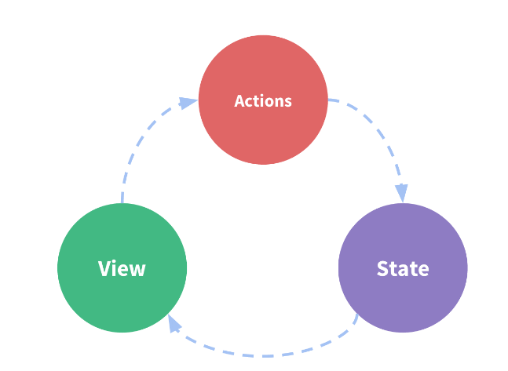
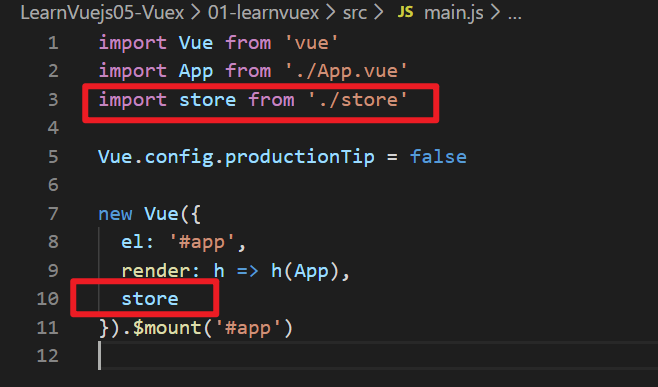
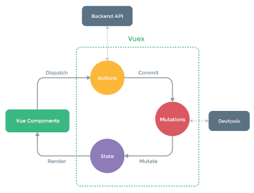

# Vuex

## 1 认识Vuex

### 1.1 什么是Vuex

Vuex 是一个状态管理模式，它采用集中式存储管理应用的所有组件的状态，并以相应的规则保证状态以一种可预测的方式发生变化。

 ### 1.2 什么是状态管理模式？

- 可以简单的看成多个组件共享变量存储在一个对象中。

这个状态自管理应用包含以下几个部分：

- **state**，驱动应用的数据源；
- **view**，以声明方式将 **state** 映射到视图；
- **actions**，响应在 **view** 上的用户输入导致的状态变化。

表示“单向数据流”理念的简单示意




## 2 Vuex的使用

### 2.1 Vuex的基本使用

1. 下载Vuex插件

   ```js
   npm install vuex --save
   ```

2. 配置：

   - 在src中创建文件夹store，创建Index.js，引入插件、使用Vue.use()安装插件、创建对象、导出对象。
   - 在main.js中引入store

   ```js
   //src/store/index.js
   import Vuex from 'vuex'
   import Vue from 'vue'
   // 1、安装插件
   Vue.use(Vuex)
   
   // 2、创建对象
   const store = new Vuex.Store({
     //保存状态
     state: {
       counter: 1000
     },
     mutations: {},
     actions: {},
     getters: {},
     modules: {}
   })
   
   //3、导出
   export default store;
   ```

   挂载

   

3. 使用：

   - 获取状态：使用$store.state.xxx获取状态
   - 修改状态：现在vuex的mutation中定义方法，再在组件事件中调用：this.$store.commit("xxx");

### 2.2 Vuex状态管理图例

Actions中处理异步操作。建议使用Mutations修改状态，不建议Vue Components直接修改状态。



```js
  //定义方法
  mutations: {
    increment(state) {
      state.counter++;
    },
    decrement(state) {
      state.counter--
    }
  },
```

### 2.3 Vuex核心概念

#### 2.3.1 State单一状态树

在一个系统中只创建一个Vuex对象，即单一数据源。

#### 2.3.2 Getters

Getters类似于computed，当需要对数据进行筛选或处理时，使用Getters。

在index.js中定义，在模板中调用：

````
{{$store.getters.agethanxStu(18)}}
````

**Getters参数传递**

getters默认是不能传递参数的, 如果希望传递参数, 那么只能让getters本身返回另一个函数。

需求1：返回年龄>x的学生名单

需求2：根据id查询学生。

>题解在：E:\Study\Front-end\vue\LearnVuejs05-Vuex\01-learnvuex 的Index.js和Hello.vue中

#### 2.3.3 Mutation

##### 2.3.3.1 Mutation更新

- vuex的store状态更新的唯一方式：提交Mutation。
- Mutation主要包括两部分：
  - 字符串的事件类型**type**
  - 回调函数，第一个参数为state **handler**
- 通过Mutation更新：this.$store.commit('xxxmutation名字')

##### 2.3.3.2 Mutation传递参数

- mutation更新数据时携带的参数，成为mutation的载荷（Payload)

  ```
  this.$store.commit('increment',1);
  ```

  如果参数为多个，则包装成对象。

##### 2.3.3.3 对象风格的提交方式

使用包含type属性的对象，整个对象都作为载荷传给mutation函数，handler保持不变