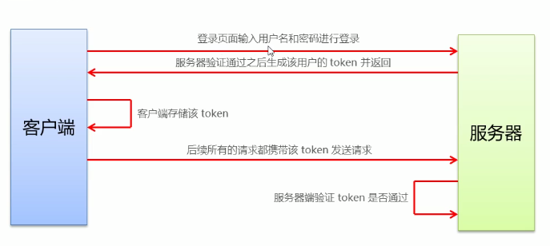
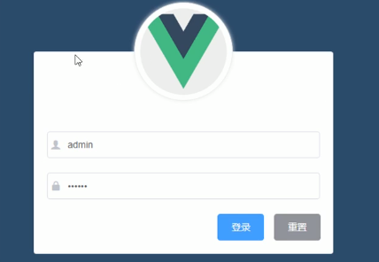
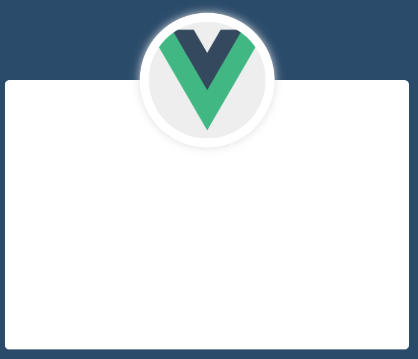

# 登录退出功能

## 1 登陆概述

### 1.1 登录业务流程

1. 输入用户名和密码
2. 调用后台接口验证
3. 根据响应状态跳转到项目主页

### 1.2 登录业务的技术点

- http是无状态的
- 通过cookie在客户端记录状态
- 通过session在服务端记录状态
- 通过token方式维持状态

cookie、session、token的使用场景？

前端与后台接口不存在跨域问题，建议使用cookie和session，否则使用token。

### 1.3 登录——token原理分析

服务器根据携带的token值去验证你是哪个用户，根据操作返回不同的结果。token主要进行客户端与服务器端之间身份校验的，token是保证登录成功之后的唯一身份令牌。



## 2 登录功能的实现

### 2.1 登录页面的布局

通过Element-UI组件实现布局

- el-form
- el-form-item
- el-input
- el-button
- 字体图标



### 2.2 创建组件并配置路由

**创建组件**

Login.vue中的script采用以下写法：

```html
<style lang="less" scoped>

</style>
```

lang="less" ：支持less写法，需要下载less-loader、less(在vue ui依赖中下载)

scoped ：样式只在本文件中有效

**配置路由**

在router/index.js中配置路径组件的映射关系

默认路径设置

```js
const routes = [
  {
    path: '',
    redirect: '/login'

  },
  {
    path: '/login',
    component: Login
  }
]

```

修改路径模式

```js
const router = new VueRouter({
  routes,
  mode: 'history'
})

```

**组件显示**

在App.vue中创建router-view标签，用于显示组件。

### 2.3 设置背景色并在屏幕中央绘制登录盒子

**背景设置**

背景全屏设置：让html、body、最外层盒子高度均为100%。

main.js中引入公共样式

```js
// 引入公共样式
require('./assets/css/global.css')
```

```css
/* 100%高度 */
html,body,#app{
  height: 100%;
  margin: 0 ;
  padding: 0;
}
```

**盒子绘制**

水平、垂直居中显示

方法1：绝对定位 + margin 负间距

```css
.login_box {
  position: absolute;
  left: 50%;
  top: 50%;
  margin-left: -225px;
  margin-top: -150px;
  width: 450px;
  height: 300px;
  background-color: white;
}
```

优点：良好的跨浏览器特性，兼容IE6-IE7。

缺点：

- 需明确知道盒子的高宽
- 不能自适应。不支持百分比尺寸和min-/max-属性设置。
-  边距大小与padding,和是否定义box-sizing: border-box有关，计算需要根据不同情况。


方法2：绝对定位+上下左右0位置定位+margin:auto

```css
.login_box {
  position: absolute;
  top: 0;
  bottom: 0;
  left: 0;
  right: 0;
  margin: auto;
  width: 450px;
  height: 300px;
  background-color: white;
}

```

优点：

- 兼容性可以,IE7及之前版本不支持
- 支持百分比%属性值和min-/max-属性
- 不论是否设置padding都可居中

缺点：

- 必须明确高度
- Windows Phone设备上不起作用。


方法3：绝对定位 + Transforms

```css
.login_box {
  position: absolute;
  left: 50%;
  top: 50%;
  transform: translate(-50%, -50%);
  width: 450px;
  height: 300px;
  background-color: white;
}
```

优点：

- 简洁方便
- 内容可变高度

缺点：

- IE8不支持
- 属性需要写浏览器厂商前缀
- 可能干扰其他transform效果


方法4：flex布局

在父容器中：

```js
.login_container {
  display: flex;
  align-items: center;
  justify-content: center;
  background-color: #2b4b6b;
  height: 100%;
}
```

优点：代码简洁、方便

缺点：兼容性差，在移动端/不考虑兼容性的前提下推荐使用。

### 2.4 绘制默认头像

过程略，！1效果

  