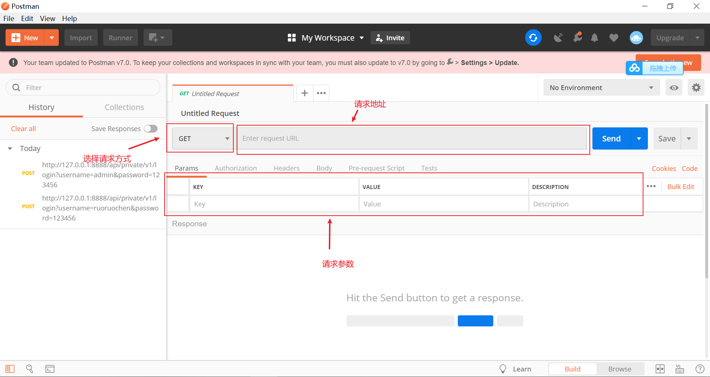
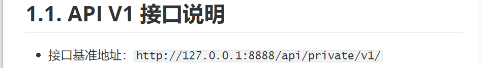
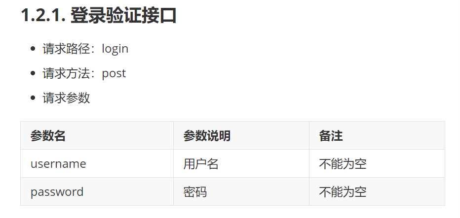
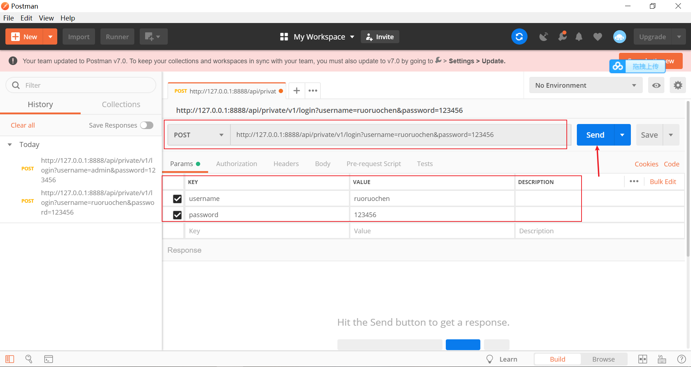
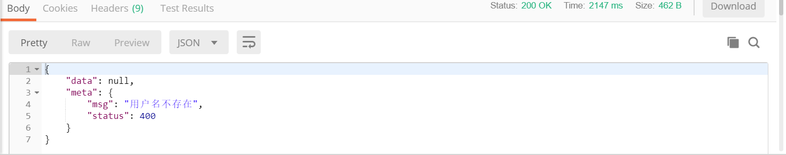
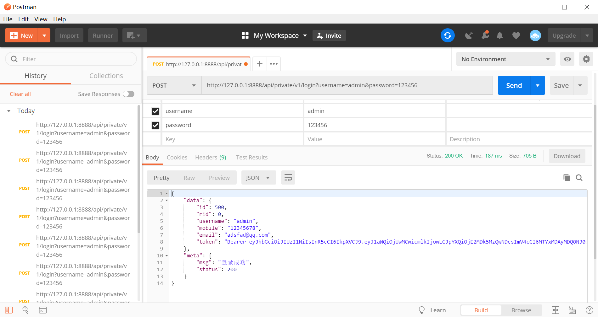

## 前期准备

- 下载MySql、Navicat。

在Navicat中创建一个mydb数据库，执行vueShop-api-server/db/mydb.sql，成功创建数据库。

电商管理后台Node服务器接口下载地址：

链接：https://pan.baidu.com/s/1oYsjFQzIxclvezljllbpkw 
提取码：qzp0 
复制这段内容后打开百度网盘手机App，操作更方便哦

内含服务器所有东西及API文档。

## 配置API接口并测试 

1. 下载Postman调试工具，用于测试后台项目接口是否正常。自行注册登录。
2. 登陆成功后，进入界面如图所示。

打开vueShop-api-server/api接口文档，我们先来测试登录验证接口

他使用的是post请求方法，路径是接口基准地址+请求路径，所以应该是：

http://127.0.0.1:8888/api/private/v1/login，接着我们在Params中输入请求参数，点击send进行测试

响应结果：

我们再测试数据库中存在的账户：

测试成功，说明后台接口没问题

