# 登录退出功能

## 1 登陆概述

### 1.1 登录业务流程

1. 输入用户名和密码
2. 调用后台接口验证
3. 根据响应状态跳转到项目主页

### 1.2 登录业务的技术点

- http是无状态的
- 通过cookie在客户端记录状态
- 通过session在服务端记录状态
- 通过token方式维持状态

cookie、session、token的使用场景？

前端与后台接口不存在跨域问题，建议使用cookie和session，否则使用token。

### 1.3 登录——token原理分析

服务器根据携带的token值去验证你是哪个用户，根据操作返回不同的结果。token主要进行客户端与服务器端之间身份校验的，token是保证登录成功之后的唯一身份令牌。


## 2 登录功能的实现

### 2.1 登录页面的布局

通过Element-UI组件实现布局

- el-form
- el-form-item
- el-input
- el-button
- 字体图标


### 2.2 创建组件并配置路由

**创建组件**

Login.vue中的script采用以下写法：

```html
<style lang="less" scoped>

</style>
```

lang="less" ：支持less写法，需要下载less-loader、less(在vue ui依赖中下载)

scoped ：样式只在本文件中有效

**配置路由**

在router/index.js中配置路径组件的映射关系

默认路径设置

```js
const routes = [
  {
    path: '',
    redirect: '/login'

  },
  {
    path: '/login',
    component: Login
  }
]

```

修改路径模式

```js
const router = new VueRouter({
  routes,
  mode: 'history'
})

```

**组件显示**

在App.vue中创建router-view标签，用于显示组件。

### 2.3 设置背景色并在屏幕中央绘制登录盒子

**背景设置**

背景全屏设置：让html、body、最外层盒子高度均为100%。

main.js中引入公共样式

```js
// 引入公共样式
require('./assets/css/global.css')
```

```css
/* 100%高度 */
html,body,#app{
  height: 100%;
  margin: 0 ;
  padding: 0;
}
```

**盒子绘制**

水平、垂直居中显示

方法1：绝对定位 + margin 负间距

```css
.login_box {
  position: absolute;
  left: 50%;
  top: 50%;
  margin-left: -225px;
  margin-top: -150px;
  width: 450px;
  height: 300px;
  background-color: white;
}
```

优点：良好的跨浏览器特性，兼容IE6-IE7。

缺点：

- 需明确知道盒子的高宽
- 不能自适应。不支持百分比尺寸和min-/max-属性设置。
-  边距大小与padding,和是否定义box-sizing: border-box有关，计算需要根据不同情况。


方法2：绝对定位+上下左右0位置定位+margin:auto

```css
.login_box {
  position: absolute;
  top: 0;
  bottom: 0;
  left: 0;
  right: 0;
  margin: auto;
  width: 450px;
  height: 300px;
  background-color: white;
}

```

优点：

- 兼容性可以,IE7及之前版本不支持
- 支持百分比%属性值和min-/max-属性
- 不论是否设置padding都可居中

缺点：

- 必须明确高度
- Windows Phone设备上不起作用。


方法3：绝对定位 + Transforms

```css
.login_box {
  position: absolute;
  left: 50%;
  top: 50%;
  transform: translate(-50%, -50%);
  width: 450px;
  height: 300px;
  background-color: white;
}
```

优点：

- 简洁方便
- 内容可变高度

缺点：

- IE8不支持
- 属性需要写浏览器厂商前缀
- 可能干扰其他transform效果


方法4：flex布局

在父容器中：

```js
.login_container {
  display: flex;
  align-items: center;
  justify-content: center;
  background-color: #2b4b6b;
  height: 100%;
}
```

优点：代码简洁、方便

缺点：兼容性差，在移动端/不考虑兼容性的前提下推荐使用。

### 2.4 绘制默认头像

过程简单，略。

效果图:


### 2.5 绘制登录表单区域

#### 2.5.1 ElementUI的使用

[ElementUI官网](https://element.eleme.cn/#/zh-CN/component/form)

j进入官网，点击组件


在左侧选择Form表单

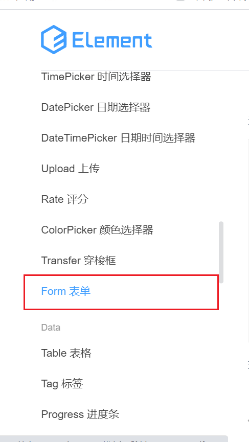

查看代码，并复制最外层的form表单和一个form-item即可。

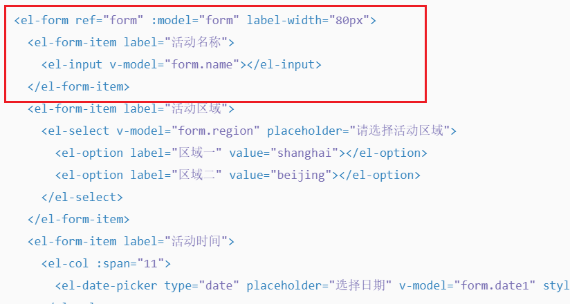

>此时浏览器报错：Unknown custom element: <el-form> - did you register the component correctly? For recursive components, make sure to provide the "name" option.
>
>我们需要在plugins/element.js中按需导入并注册
>
>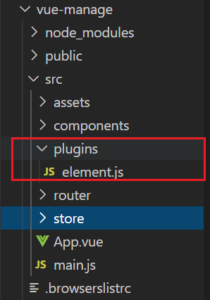
>
>```js
>import Vue from 'vue'
>import { Button, Form, FormItem, Input } from 'element-ui'
>Vue.use(Button)
>Vue.use(Form)
>Vue.use(FormItem)
>Vue.use(Input)
>```

#### 2.5.2 绘制带Icon的输入框

复制即可，若想切换icon图标，可选择左侧栏的icon图标，选择图标集合

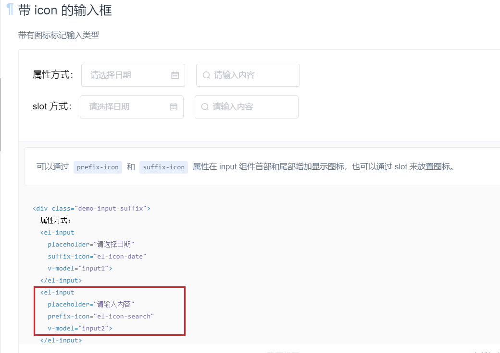

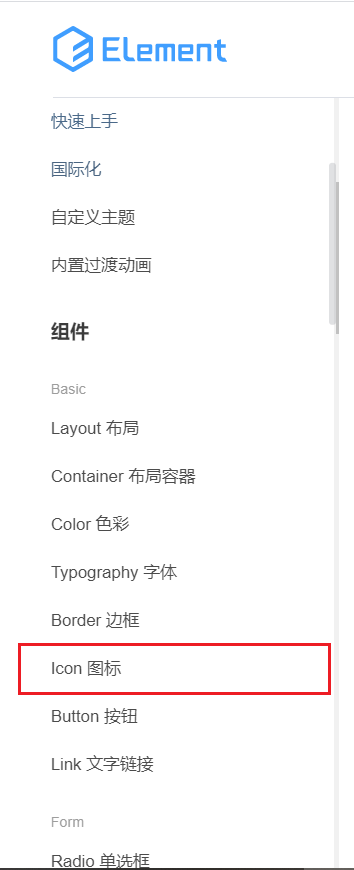

如果不想用官网的图标，可以选择自行选择第三方库的图标，此处以阿里图标库为例，将选好的图标放入购物车，打开右侧的侧边栏，选择下载代码，将压缩包解压至项目中。

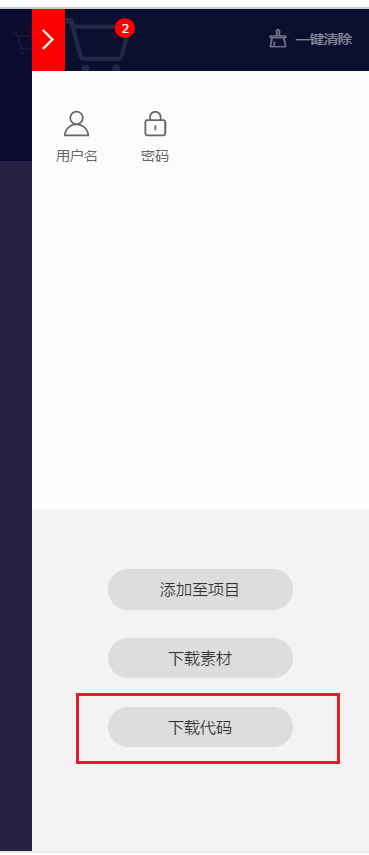

打开demo.html，选择font-class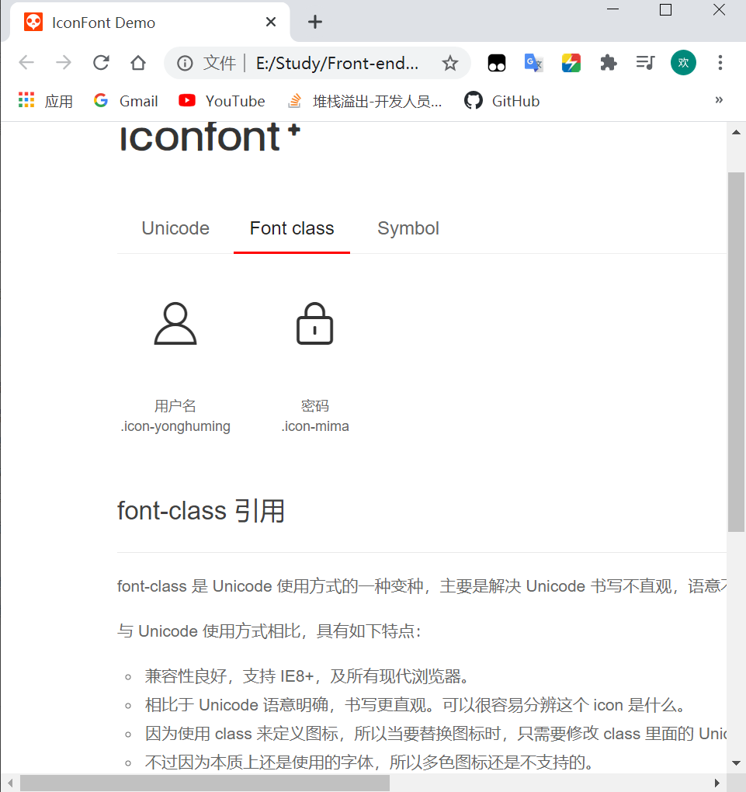

在main.js导入字体图标

挑选相应图标并获取类名，应用于页面：

```html
 <el-input prefix-icon="iconfont icon-mima"></el-input>
```

#### 2.5.3 实现表单的数据绑定

1. 添加data数据对象
2. 为el-form添加 :model数据绑定form对象 （:model相当于v-bind:model，即绑定属性）
3. 为每一个表单项使用v-model双向绑定到数据对象的具体项中

```html
<!-- 登录表单区 -->
<el-form label-width="0" class="login_form" :model="loginForm">
    <!-- 用户名 -->
    <el-form-item>
        <el-input prefix-icon="iconfont icon-yonghuming" v-model="loginForm.username">			</el-input>
    </el-form-item>
    <!-- 密码 -->
    <el-form-item>
        <el-input prefix-icon="iconfont icon-mima" v-model="loginForm.password" 				type="password"></el-input>
    </el-form-item>
    <!-- 按钮区 -->
    <el-form-item class="btns">
        <el-button type="primary">登录</el-button>
        <el-button type="info">重置</el-button>
    </el-form-item>
</el-form>
```

```js
data() {
    return {
        loginForm: {
            username: "",
            password: ""
        }
    };
}
```

#### 2.5.4 实现表单数据验证

在Form表单中下滑至表单验证，查看其代码

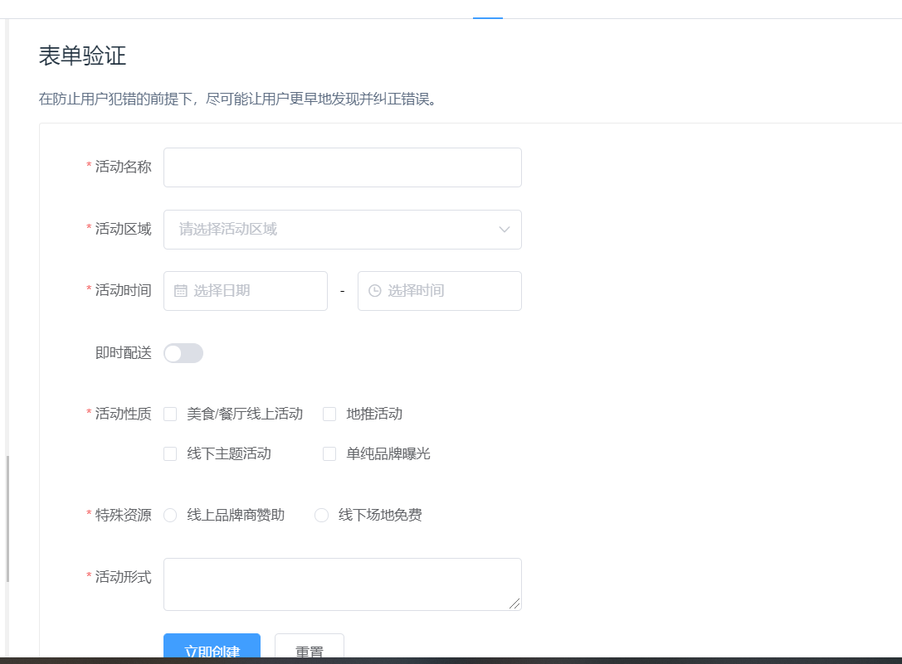

ElementUI的Form 组件提供了表单验证的功能，只需要通过 `rules` 属性传入约定的验证规则，并将 Form-Item 的 `prop` 属性设置为需校验的字段名即可。

验证规则如下，在data中创建一个rules对象，其中每一个元素为一个数组，每一个数组为一个数据定义验证规则（可定义多个规则），其中数组中的每个对象的属性有：是否必需required、提示信息message、最小长度min、最大长度max、数据类型type、触发事件trigger等。（可选）

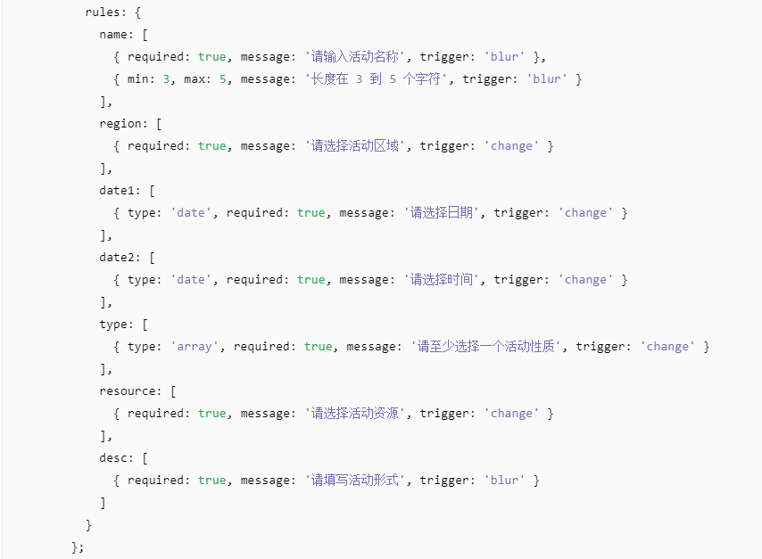

##### 表单验证使用

1. 在data中创建验证规则对象rules

2. 给表单el-form绑定验证规则对象  使用:rules ="rules"

3. 给el-form-item项添加 prop="xxx" ，即表示我们希望使用xxx验证规则验证item里的表单数据项。

   > 注意：
   >
   > - xxx，为rules的元素,不需要rules.xxx
   > - prop不需要加"："，且prop是加在form-item上

```js
loginRules: {
    // 验证用户名是否合法
    username: [
        {
            required: true,
            message: "请输入登录名称",
            trigger: "blur"
        },
        {
            min: 6,
            max: 16,
            message: "用户名长度需为6~16位之间",
            trigger: "blur"
        }
    ],
        // 验证密码是否合法
        password: [
            { required: true, message: "请输入密码", trigger: "blur" },
            { min: 6, max: 16, message: "密码需要在6~16位之间", trigger: "blur" }
        ]
}
```

#### 2.5.5 表单重置功能

在Form表单页继续往下翻，在Form Methods中存在resetFields方法，此时，我们只需要获取页面中表单，调用其重置方法，即可实现。

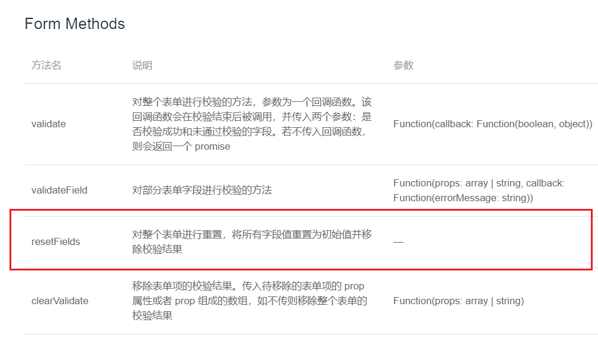

那么如何获取表单呢？

我们给表单加一个引用ref="loginFormRef"，在进行事件监听时，我们可以通过this.$refs.引用名获取引用对象。

于是我们可以总结出实现重置功能的步骤：

1. 在表单中添加引用ref="loginFormRef"
2. 给重置按钮增加点击监听事件@click="xxx"
3. 在处理方法中调用this.$refs.loginFormRef.resetFields()

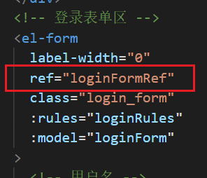

```js
  methods: {
    reset() {
      // console.log(this);
      this.$refs.loginFormRef.resetFields();
    }
  }
```

#### 2.5.6 登录前表单数据预验证

我们使用Form表单的validate方法对整个表单进行验证，该方法参数为回调函数，其中回调函数又接受两个参数：校验是否成功的bool值，未通过校验字段。

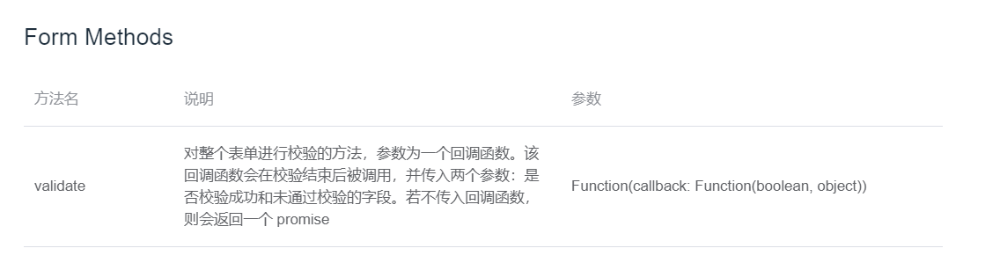

步骤：

1. 给表单添加引用
2. 给登录按钮添加点击事件
3. 在处理函数中调用validate方法，根据其bool值决定请求/不发起请求

#### 2.5.7 配置axios发起登录请求

在main.js中进行全局配置：

1. 导入axios包
2. 挂载到Vue原型对象上
3. 设置请求根路径

```js
import axios from "axios"
Vue.prototype.$http = axios
// 配置请求根路径
axios.defaults.baseURL = "http://127.0.0.1:8888/api/private/v1/"
```

在监听事件中发起登录请求：

```js
loginbtn() {
    this.$refs.loginFormRef.validate(async valid => {
        if (!valid) return;
        //post方法返回一个Promise对象 使用async 函数
        //async表示该函数中有异步操作 await表示后面表达式需要等待结果
        //使用对象解构 并起别名，此时获得的data数据干净
        const { data: res } = await this.$http.post("login", this.loginForm);
        //通过res.meta.status状态码判断请求
        if (res.meta.status === 200) {
            return console.log("登陆成功");
        } else {
            return console.log("登陆失败");
        }
    });
}
```

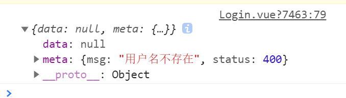

#### 2.5.8 配置Message全局弹框提示

使用ElementUI中的Message消息提示

使用步骤：

1. 在element.js中导入Message组件
2. **!!!与其他组件不同，Message组件不是注册，而是挂载到Vue原型对象上**
3. 在监听事件中调用

```js
 if (res.meta.status === 200) {
     return this.$message.success("登陆成功");
 } else {
     return this.$message.error("登陆失败！");
 }
```

其中调用不同状态方法有两种写法：

```js
//1、通过对象type传值 
this.$message({
     message: '登陆成功',
     type: 'success'
 });
//2、直接调用
this.$message.success("登陆成功");
```

#### 2.5.9 完善登陆之后的操作

实现步骤：

1. 将登陆成功之后的token保存至客户端的sessionStorage中
   -  项目中除了登录之外的其他API接口，必须在登录之后才能访问
   - token只应在当前网站打开期间生效，所以放在session里而不是local中
2. 通过路由跳转至后台主页

```js
window.sessionStorage.setItem("token", res.data.token);
this.$router.push("/home");
```

#### 2.5.10 路由导航守卫控制页面访问权限

全局前置守卫，路由跳转前被拦截，如果用户访问登录页，直接放行；否则判断用户是否存在token，若不存在则自动跳转至登录页。

router/index.js

```js
router.beforeEach((to, form, next) => {
  if (to.path === '/login') return next();
  const token = window.sessionStorage.getItem('token');
  if (!token) return next('/login');
  next();
})
```

#### 2.5.11 退出功能的实现

核心原理：清空token，后续请求不携带token，必须重新登录生成新token后才能访问页面。

给按钮添加点击事件

```js
logout() {
    window.sessionStorage.clear();
    this.$router.push("/login");
}
```

