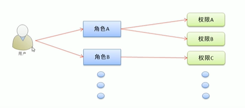
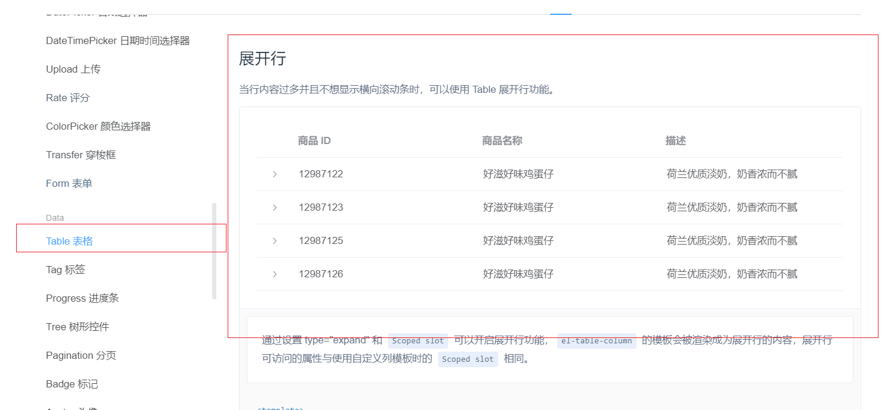
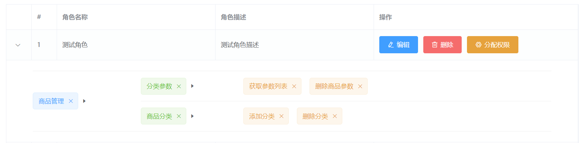

# 用户权限管理

## 1 权限列表

### 1.1 绘制权限列表的面包屑导航

方式与之前相同

### 1.2 卡片视图

与之前相同

### 1.3 调用API获取权限列表

步骤：

1. 生名周期钩子函数created时调用getRightsList方法，发起数据请求，将数据保存至本地data中

2. 使用表格渲染权限列表，添加：

   ```html
   <el-table-column type="index" label="#" width="50"></el-table-column>
   ```

3. 自定义权限等级，使用作用域插槽形式，使用v-if v-else-if判断显示那个tag标签

   ```html
   <el-table-column prop="level" label="权限等级">
       <template v-slot="scope">
           <el-tag v-if="scope.row.level === '0'">一级</el-tag>
           <el-tag v-else-if="scope.row.level === '1'" type="success">二级</el-tag>
           <el-tag v-else type="warning">三级</el-tag>
       </template>
   </el-table-column>
   ```

### 1.4 权限管理业务分析

通过角色的方式进行权限控制，给每个用户分配一个特定的角色，角色包括不同的功能权限。



## 2 角色列表

基本布局

### 2.1 角色下权限数据的渲染

展开行的使用



效果：



整体构思：先HTML 再CSS 最后JS添加行为

```html
//展开行
<el-table-column type="expand">
    //作用域插槽
    <template v-slot="scope">
        //循环最外层的权限（一级权限）
        <el-row
                :class="['bdbottom',i1 === 0? 'bdtop':'','vcenter']"
                v-for="(item1,i1) in scope.row.children"
                :key="item1.id"
                >
            <!-- 渲染一级权限 -->
            <el-col :span="5">
                <el-tag closable @close="removeById(scope.row,item1.id)">{{item1.authName}}</el-tag>
                <i class="el-icon-caret-right"></i>
            </el-col>
            <!-- 渲染二级、三级权限 -->
            //为什么 二三级要放一起：因为同一类别下的三级权限与二级在同一行，不应换row
            <el-col :span="19">
                <!-- 通过for循环嵌套渲染二级权限 -->
                <el-row
                        :class="[i2===0?'':'bdtop','vcenter']"
                        v-for="(item2,i2) in item1.children"
                        :key="item2.id"
                        >
                    //渲染
                    <el-col :span="6">
                        <el-tag
                                type="success"
                                closable
                                @close="removeById(scope.row,item2.id)"
                                >{{item2.authName}}</el-tag>
                        <i class="el-icon-caret-right"></i>
                    </el-col>

                    <el-col :span="18">
                        <el-col>
                            <el-tag
                                    :class="['thirdtag']"
                                    v-for="(item3,i3) in item2.children"
                                    :key="item3.id"
                                    type="warning"
                                    closable
                                    @close="removeById(scope.row,item3.id)"
                                    >{{item3.authName}}</el-tag>
                        </el-col>
                    </el-col>
                </el-row>
            </el-col>
        </el-row>
    </template>
</el-table-column>
```

