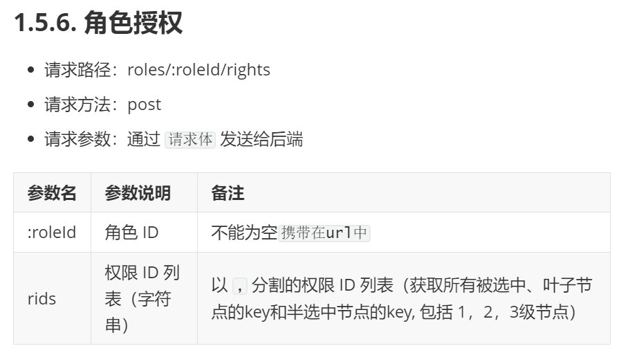

# 用户权限管理

## 1 权限列表

### 1.1 绘制权限列表的面包屑导航

方式与之前相同

### 1.2 卡片视图

与之前相同

### 1.3 调用API获取权限列表

步骤：

1. 生名周期钩子函数created时调用getRightsList方法，发起数据请求，将数据保存至本地data中

2. 使用表格渲染权限列表，添加：

   ```html
   <el-table-column type="index" label="#" width="50"></el-table-column>
   ```

3. 自定义权限等级，使用作用域插槽形式，使用v-if v-else-if判断显示那个tag标签

   ```html
   <el-table-column prop="level" label="权限等级">
       <template v-slot="scope">
           <el-tag v-if="scope.row.level === '0'">一级</el-tag>
           <el-tag v-else-if="scope.row.level === '1'" type="success">二级</el-tag>
           <el-tag v-else type="warning">三级</el-tag>
       </template>
   </el-table-column>
   ```

### 1.4 权限管理业务分析

通过角色的方式进行权限控制，给每个用户分配一个特定的角色，角色包括不同的功能权限。


## 2 角色列表

基本布局

### 2.1 角色下权限数据的渲染

展开行的使用


效果：


整体构思：先HTML 再CSS 最后JS添加行为

```html
//展开行
<el-table-column type="expand">
    //作用域插槽
    <template v-slot="scope">
        //循环最外层的权限（一级权限）
        <el-row
                :class="['bdbottom',i1 === 0? 'bdtop':'','vcenter']"
                v-for="(item1,i1) in scope.row.children"
                :key="item1.id"
                >
            <!-- 渲染一级权限 -->
            <el-col :span="5">
                <el-tag closable @close="removeById(scope.row,item1.id)">{{item1.authName}}</el-tag>
                <i class="el-icon-caret-right"></i>
            </el-col>
            <!-- 渲染二级、三级权限 -->
            //为什么 二三级要放一起：因为同一类别下的三级权限与二级在同一行，不应换row
            <el-col :span="19">
                <!-- 通过for循环嵌套渲染二级权限 -->
                <el-row
                        :class="[i2===0?'':'bdtop','vcenter']"
                        v-for="(item2,i2) in item1.children"
                        :key="item2.id"
                        >
                    //渲染
                    <el-col :span="6">
                        <el-tag
                                type="success"
                                closable
                                @close="removeById(scope.row,item2.id)"
                                >{{item2.authName}}</el-tag>
                        <i class="el-icon-caret-right"></i>
                    </el-col>

                    <el-col :span="18">
                        <el-col>
                            <el-tag
                                    :class="['thirdtag']"
                                    v-for="(item3,i3) in item2.children"
                                    :key="item3.id"
                                    type="warning"
                                    closable
                                    @close="removeById(scope.row,item3.id)"
                                    >{{item3.authName}}</el-tag>
                        </el-col>
                    </el-col>
                </el-row>
            </el-col>
        </el-row>
    </template>
</el-table-column>
```

## 3 分配权限

1. 点击分配权限，显示对话框
2. 发起请求获取权限数据，并保存至data中。由于我们需要渲染成树形结构，故请求参数type选择tree
3. 将数据按级渲染

- 数据渲染

此时需要使用到新的组件：Tree，进行数据树形结构渲染

```html
 <!-- 分配权限对话框 -->
<el-dialog title="分配权限" :visible.sync="setRightDialogVisible" width="40%">
    <!-- 内容主体 -->
    <!-- 树形控件 -->
    <el-tree :data="rightsList" :props="treeProps" show-checkbox></el-tree>
    <span slot="footer" class="dialog-footer">
        <el-button @click="setRightDialogVisible = false">取 消</el-button>
        <el-button type="primary" @click="setRightDialogVisible = false">确 定</el-button>
    </span>
</el-dialog>
```

data设定数据源，props设定从数据源的哪些数据项获取。

- 给tree增加node-key属性。

  每个树节点用来作为唯一标识的属性，整棵树应该是唯一的。这意味着，你选择了我这个节点，就是选择了这个id值。

```html
<el-tree :data="rightsList" :props="treeProps" show-checkbox node-key="id"></el-tree>
```

- 打开分配权限管理时，设置树自动展开。

default-expand-all，是否默认展开所有节点。将其设为true

```html
<el-tree :data="rightsList" :props="treeProps" show-checkbox node-key="id" default-expand-all></el-tree>
```

- 实现角色已有权限默认勾选

  给tree增加default-checked-keys属性，绑定选中节点id值数组。

```html
<el-tree
         :data="rightsList"
         :props="treeProps"
         show-checkbox
         node-key="id"
         default-expand-all
         :default-checked-keys="defKeys"
         ></el-tree>
```

将三级权限的id值存入defKeys中，使用递归

- 实现角色授权功能

使用getCheckedKeys、getHalfCheckedKeys方法获取已选中、班选中的Id，将其作为请求参数进行角色授权。

使用展开运算符... 将数组展开放入数组中



由于传参需要为字符串形式且，分割故使用join进行转换。

```js
const idStr = keys.join(",");
```

```js
 //点击为角色分配函数
async allotRights() {
    const keys = [
        ...this.$refs.treeRef.getCheckedKeys(),
        ...this.$refs.treeRef.getHalfCheckedKeys()
    ];
    console.log(keys);
    console.log(this.roleId);

    const idStr = keys.join(",");
    console.log(idStr);

    const { data: res } = await this.$http.post(
        `roles/${this.roleId}/rights`,
        {
            rids: idStr
        }
    );
    console.log(res);
    if (res.meta.status != 200) return this.$message.error("权限更新失败");
    this.$message.success("权限更新成功。");
    this.getRolesList();
    this.setRightDialogVisible = false;
}
```

## 4 分配角色

点击分配角色按钮，弹出对话框。

- 在显示对话框前，先获取所有角色列表。

```js
async showSetRoleDialog(userinfo) {
    // 在展示对话框之前获取角色列表
    const { data: res } = await this.$http.get("roles");
    console.log(res);
    if (res.meta.status !== 200)
        return this.$message.error("获取用户列表失败");
    this.rolesList = res.data;
    
    this.userInfo = userinfo;
    this.setRoleDialogVisible = true;
}
```

- 使用新的UI控件：Select 选择器
- 添加点击“确定”事件监听，如果用户选择了角色，发送请求，否则，提示用户选择分配的角色。

```js
async saveRoleInfo() {
    //判断用户是否选择角色
    if (!this.selectRoleId) {
        return this.$message.error("请选择要分配的角色");
    }
    // 分配用户角色
    const { data: res } = await this.$http.put(
        `users/${this.userInfo.id}/role`,
        {
            rid: this.selectRoleId
        }
    );
    console.log(res);
    if (res.meta.status !== 200) return this.$message.erro("分配角色失败");
    this.$message.success("分配角色成功");
    this.getUserList();
    this.setRoleDialogVisible = false;
}
```

- 其他细节：

选择角色后重新打开，其选择项还是旧数据，解决方法：

给分配角色Dialog设置一个close事件，其事件处理函数将选择器绑定数据、获取用户数据置空。

```js
 editDialogClosed() {
      this.selectRoleId = "";
      this.userInfo = [];
    }
```

