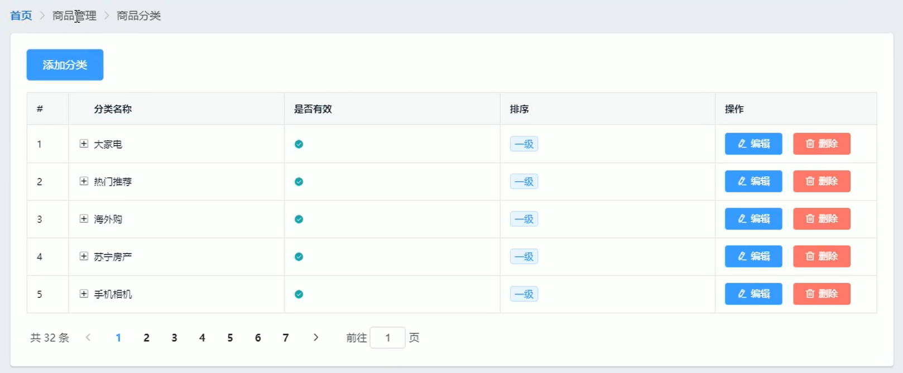
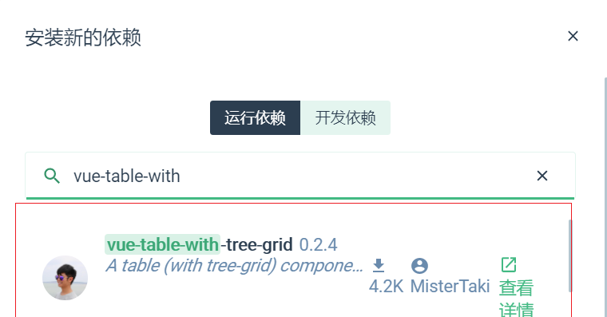
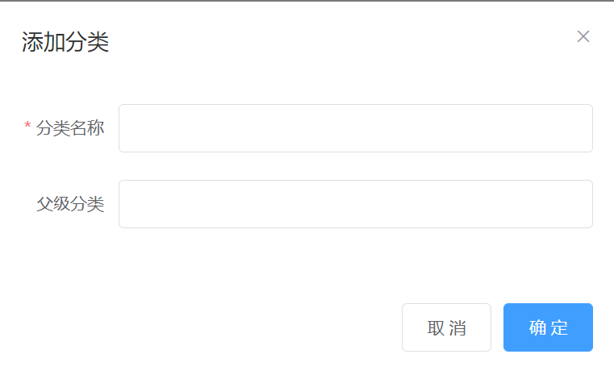
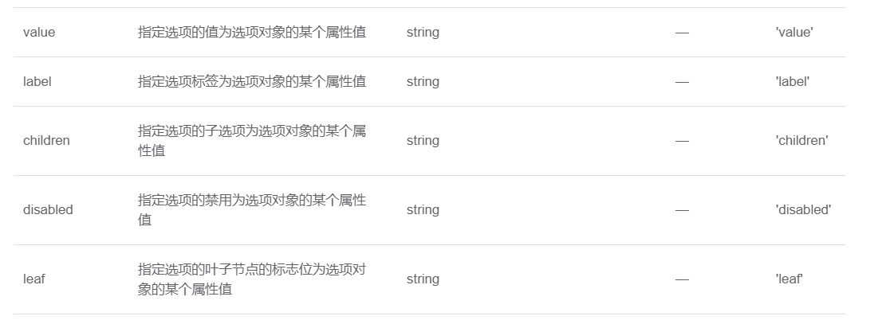

# 商品分类

## 1 商品分类界面的基本布局

效果图：



基本布局：面包屑导航+卡片视图+第三方树形表格

## 2 调用API获取商品分类数据

注意，需要制定pagenum和pagesize才能实现分页效果。保存商品分类总数和数据到data中

```js
data(){
    return{
      CateList: [],
      //查询条件
      queryInfo: {
        type: 3,
        pagenum: 3,
        pagesize: 5
      },
      total: 0
    }
}
```

```js
async getCateList() {
      const { data: res } = await this.$http.get("categories", {
        params: this.queryInfo
      });
      console.log(res);
      if (res.meta.status !== 200) {
        return this.$messgae.error("获取商品分类数据失败");
      }
      console.log(res.data);

      this.CateList = res.data.result;
      this.total = res.data.total;
      // console.log(this.CateList);
    }
```

## 3 使用vue-table-with-tree-grid树形表格组件

打开VueUI→依赖→安装依赖→运行依赖vue-table-with.....→安装



安装好后点击详情进入github使用demo


注册插件的方法：

1. 使用Vue.use进行自动注册

```js
import Vue from 'vue'
import ZkTable from 'vue-table-with-tree-grid'

Vue.use(ZkTable)
```

  2.在入口文件导入插件，使用Vue.component手动注册

```js
import Vue from 'vue'
import ZkTable from 'vue-table-with-tree-grid'

Vue.component(ZkTable.name, ZkTable)
```


从demo中复制html结构，修改细节

- 设置为禁止多选类型表格

  给表格添加selection-type属性 false

- 去除展开行效果

  添加expand-type属性false

- 渲染索引列

  添加show-index属性true

  设置序号列标题：index-text=“xxx”

- 移除鼠标高亮

  添加show-row-hover属性 false

## 4 渲染添加分类的对话框和表单



基础内容不再赘述。

### 4.1 获取父级分类数据列表并使用级联选择器渲染

数据获取：按照api文档发起请求并保存数据就好了

#### Cascader 级联选择器的基本使用

- options属性：用来指定数据源，键名可通过 `Props` 属性配置
- props属性：级联选择器的配置选项



```js
//指定级联选择器的配置选项
CascaderProps: {
value: "cat_id",
label: "cat_name",
children: "children",
expandTrigger: "hover"
},
//选中的父级分类id数组
selectKeys: []
```

```html
<el-cascader
             v-model="selectKeys"
             :options="ParantCateList"
             :props="CascaderProps"
             @change="parentCateChange"
             ></el-cascader>
```

此时级联选择器高度过高，需进行调整

```css
.el-cascader-panel {
  height: 200px;
  width: 100%;
}
```

- 使用属性 clearable true支持清空

- 级联选择器默认只能选择最后一级分类，要想支持任意级分类，需要在：props中加 checkStrictly 为True

  

#### 获取用户填写表单信息

```js
 //选择项发生变化触发这个函数
parentCateChange() {
    console.log(this.selectKeys);
    if (this.selectKeys.length > 0) {
        this.addCateForm.cat_pid = this.selectKeys[this.selectKeys.length - 1];
        // 等级赋值
        this.addCateForm.cat_level = this.selectKeys.length;
        return;
    } else {
        this.addCateForm.cat_pid = 0;
        // 等级赋值
        this.addCateForm.cat_level = 0;
    }
},
```

#### 重置表单数据

当用户关闭对话框，清空表单数据

- 添加表单引用
- 调用其resetFields方法，并重置级联选择器绑定值为空。

```js
//重置表单数据
addCateDialogClose() {
    this.$refs.cateFormRef.resetFields();
    this.selectKeys = [];
    this.addCateForm.cat_level = 0;
    this.addCateForm.cat_pid = 0;
}
```

#### 完成添加分类操作

```js
addCate() {
    console.log(this.addCateForm);
    //表单域验证
    this.$refs.cateFormRef.validate(async valid => {
        if (!valid) return this.$message.error("表单数据错误，请重新填写");
        const { data: res } = await this.$http.post(
            "categories",
            this.addCateForm
        );
        console.log(res);
        if (res.meta.status !== 201) return this.$message.error("添加分类失败");
        this.$message.success("添加分类成功");
        this.getCateList();
        this.addCatedialogVisible = false;
    });
},
```

编辑删除功能自行完成。至此商品分类模块功能就做完啦~