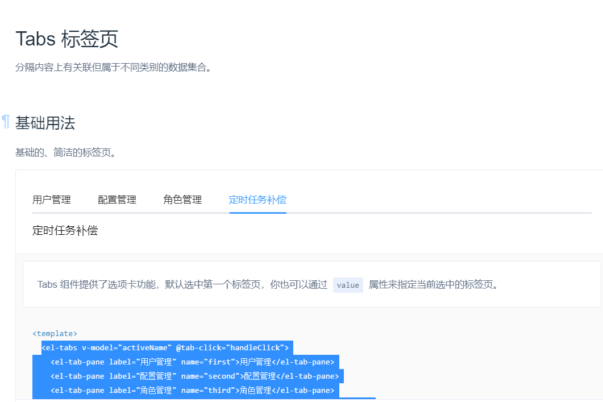
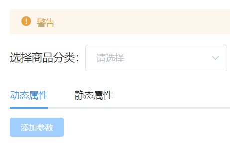
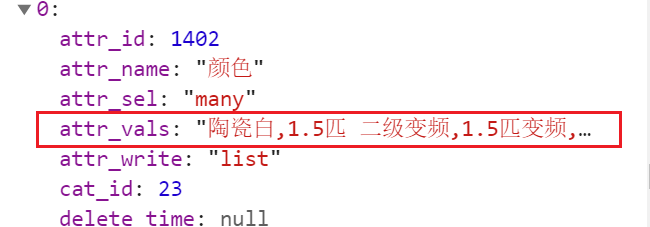
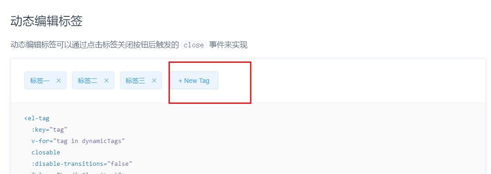
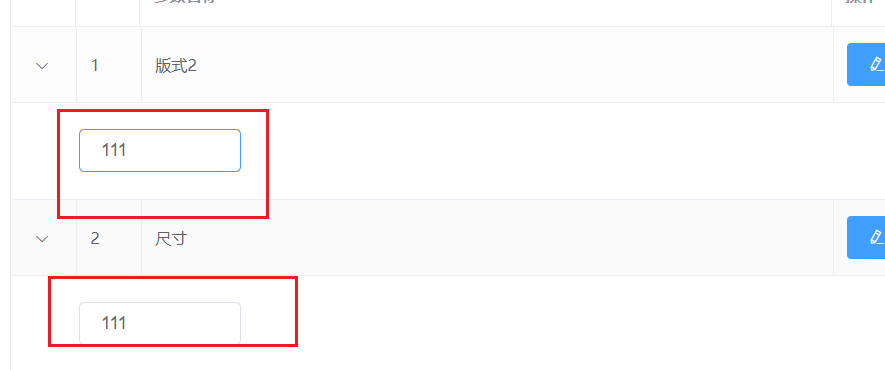

### 参数管理

## 1 参数管理概念


## 2 基本UI布局

略

## 3 获取商品分类列表数据并渲染至级联选择框

获取数据略，级联选择框与06类似。

## 4 Tab标签页的使用



```html
<!-- 标签页 -->
<el-tabs v-model="activeName" @tab-click="handleTabClick">
    <el-tab-pane label="动态属性" name="first">动态属性</el-tab-pane>
    <el-tab-pane label="静态属性" name="second">静态属性</el-tab-pane>
</el-tabs>
```

data:

```js
// 被激活的页签名称
activeName: "first"
```

### 禁用按钮



使用计算属性，当selectKeys长度>0时，btn disabled false。

## 5 分类参数

### 5.1 获取参数列表数据

```js
async getParams() {
    const { data: res } = await this.$http.get(
        `categories/${
        this.selectCateKeys[this.selectCateKeys.length - 1]
        }/attributes`,
        {
            params: {
                sel: this.activeName
            }
        }
    );
    console.log(res);
    if (res.meta.status !== 200) {
        return this.$message.error("获取分类参数失败");
    }
    this.paramsList = res.data;
}
```

### 5.2 获取到的参数数据挂载到不同数据源上

对获取到的数据进行判断，分别存入不同的数据中

```js
//动态
if (res.data.attr_sel === "many") this.manyTableData = res.data;
//静态
else this.onlyTableData = res.data;
```

使用Table表格渲染数据，略

### 5.3 渲染参数下的可选性。



获取参数数据时，将attr_vals从字符串转数组。

**注意：需要对其是否为空进行判断，如果空直接返回空数组。不然会导致空字符串转化成【“”】的结果**

```js
//将attr_val从字符串变为数组
res.data.forEach(item => {
    item.attr_vals = item.attr_vals ? item.attr_vals.split(",") : [];
});
```

```html
 <!-- 展开行 -->
<el-table-column type="expand">
    <template v-slot="scope">
        <el-tag v-for="(item,i) in scope.row.attr_vals" :key="i" closable>{{item}}</el-tag>
    </template>
</el-table-column>
```

### 5.4 可选性的添加按钮

使用Tag里面的动态编辑标签



完成以上功能后，发现多个参数的输入框联动改变，原因在于共用一个inputvalue



**改进**

在获取参数列表书，给其添加inputValue属性

```js
//将attr_val从字符串变为数组
res.data.forEach(item => {
    //控制文本框的显示与隐藏
    item.inputVisible = false;
    item.inputValue = "";
    item.attr_vals = item.attr_vals ? item.attr_vals.split(",") : [];
});
```

**让文本框获得焦点**

```js
showInput(row) {
    row.inputVisible = true;
    this.$nextTick(_ => {
        this.$refs.saveTagInput.$refs.input.focus();
    });
}
```

this.$nextTick当页面元素被重新渲染时，执行回调函数的代码。 