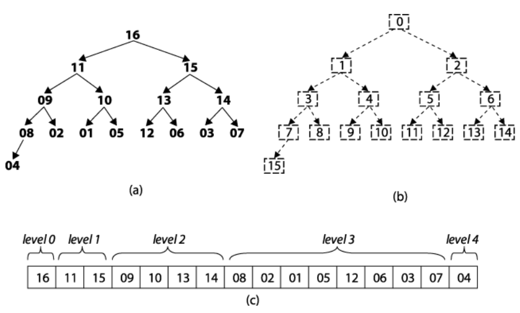

# 堆的基本操作

## 基本结构



- 堆的底层实际上是一棵完全二叉树。
- 可以用数组实现
- 每个的节点元素值不小于其子节点 - 最大堆
- 每个的节点元素值不大于其子节点 - 最小堆
- **重点！！！在算法中经常使用** 一般都用数组来表示堆，第一个节点的下标索引为0，i结点的父结点下标就为(i – 1) / 2。它的左右子结点下标分别为2 * i + 1和2 * i + 2。如第0个结点左右子结点下标分别为1和2。

### 大顶堆

从第一个非叶子节点开始依次对数组中的元素进行下沉操作

- 和孩子节点的最大值`max`比较
- 大于`max` — 不需要在下沉
- 小于`max` — 和`max`交换位置 - 继续和下一层孩子节点比较，直到队列末尾

```js
function ajustMaxHeap(array, index, length) {
    //i为每一层的第一个节点
    for (let i = 2 * index + 1; i < length; i = 2 * i + 1) {
        //同层的下一个节点存在 且数值比该节点小 向右移动
        if (i + 1 < length && array[i + 1] > array[i]) {
            i++;
        }
        //如果顶层节点大于底层节点，break
        if (array[index] >= [array[i]]) {
            break;
        } else {
          //交换
            [array[index], array[i]] = [array[i], array[index]];
            index = i;
        }
    }
}

//构建大顶堆
function createMaxHeap(arr, length) {
    // 子树数目
    for (let i = Math.floor(length / 2) - 1; i >= 0; i--) {
        //调整大顶堆
        ajustMaxHeap(arr, i, length);
    }
    return arr;
}
```

### 小顶堆

从第一个非叶子节点开始依次对数组中的元素进行下沉操作

- 和孩子节点的最小值`min`比较
- 小于`min` — 不需要在下沉
- 大于`min` — 和`min`交换位置（下沉） - 继续和下一层孩子节点比较，直到队列末尾

```js
function ajustMinHeap(array, index, length) {
      for (let i = 2 * index + 1; i < length; i = 2 * i + 1) {
        if (i + 1 < length && array[i + 1] < array[i]) {
          i++;
        }
        if (array[index] < [array[i]]) {
          break;
        } else {
          [array[index], array[i]] = [array[i], array[index]];
          index = i;
        }
      }
    }

    function createMinHeap(arr, length) {
      for (let i = Math.floor(length / 2) - 1; i >= 0; i--) {
        ajustMinHeap(arr, i, length);
      }
      return arr;
    }
```

## 堆的插入

- 由于堆属于优先队列，只能从末尾添加
- 添加后有可能破坏堆的结构，需要从下到上进行调整
- 如果元素小于父元素，上浮（小顶堆）

```js
 function minHeapAdd(array = [], element) {
      array.push(element);
      if (array.length > 1) {
        //最后一个节点的下标
        let index = array.length - 1;
        //找到其父节点 向下取整
        let target = Math.floor((index - 1) / 2);
        while (target >= 0 ) { 
          //如果当前值小于父节点
          if (array[index] < array[target]) {
            //交换
            [array[index], array[target]] = [array[target], array[index]]
            //当前值下标改变
            index = target;
            //继续取其父节点
            target = Math.floor((index - 1) / 2);
          } else {
            break;
          }
        }
      }
      return array;
    }
```

## 堆的封装

```js
//封装堆
function Heap(type = 'min') {
    //类型和值
    this.type = type;
    this.value = [];
}

//在其原型对象上定义create方法
Heap.prototype.create = function () {
    const length = this.value.length;
    //子树个数
    for (let i = Math.floor((length / 2) - 1); i >= 0; i--) {
        this.ajust(i, length);
    }
}

//调整堆
Heap.prototype.ajust = function (index, length) {
    const array = this.value;
    //i为每一层的第一个节点
    for (let i = 2 * index + 1; i < length; i = 2 * i + 1) {
       	//同层的下一个节点存在 且数值比该节点小 向右移动
        if (i + 1 < length) {
            if ((this.type === 'max' && array[i + 1] > array[i]) ||
                (this.type === 'min' && array[i + 1] < array[i])) {
                i++;
            }
        }
        //如果顶层节点<当前节点(大顶堆未实现)，交换；如果顶层节点>当前节点（小顶堆未实现），交换
        if ((this.type === 'max' && array[index] < [array[i]]) ||
            (this.type === 'min' && array[index] > [array[i]])) {
            [array[index], array[i]] = [array[i], array[index]];
            index = i;
        } else {
            //成功，break;
            break;
        }
    }
}

//添加数字，调整堆
Heap.prototype.add = function (element) {
    const array = this.value;
    array.push(element);
    if (array.length > 1) {
        let index = array.length - 1;
        let target = Math.floor((index - 1) / 2);
        while (target >= 0) {
            if ((this.type === 'min' && array[index] < array[target]) ||
                (this.type === 'max' && array[index] > array[target])) {
                [array[index], array[target]] = [array[target], array[index]]
                index = target;
                target = Math.floor((index - 1) / 2);
            } else {
                break;
            }
        }
    }
}

//堆顶出
Heap.prototype.pop = function () {
    const array = this.value;
    let result = null;
    if (array.length > 1) {
        result = array[0];
        array[0] = array.pop();
        //调整最大一棵树
        this.ajust(0, array.length);
    } else if (array.length === 1) {
        return array.pop();
    }
    return result;
}
```

```js
//测试代码
var heap = new Heap('max');
heap.add(6)
heap.add(10)
console.log(heap.value);
console.log(heap.pop());
console.log(heap.value);
```

