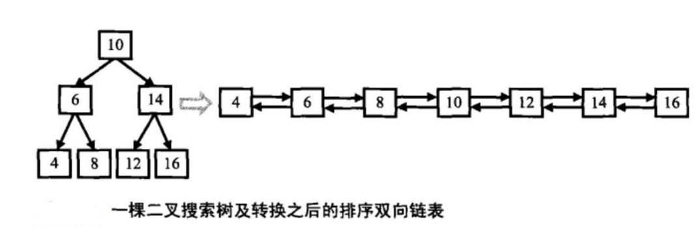
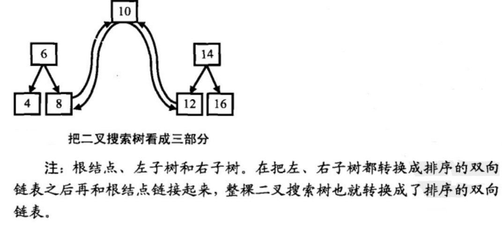
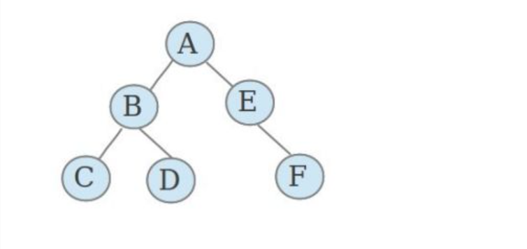

# 平衡二叉树、二叉树的经典题

### 1 平衡二叉树

#### 题目

输入一棵二叉树，判断该二叉树是否是平衡二叉树。

> 平衡二叉树：每个子树的深度之差不超过1

#### 思路

- 后续遍历二叉树，在遍历二叉树每个节点前都会遍历其左右子树

- 比较左右子树的深度，若差值>1则返回一个标记-1表示当前子树不平衡
- 若左右子树存在一个不平衡或左右子树差值大于1，则整棵树不平衡
- 若左右子树平衡，则返回当前树深：左右子树最大深度+1

#### 代码

```js
function IsBalanced_Solution(pRoot) {
  return balanced(pRoot) != -1;
}
function balanced(node) {
  //空树，平衡，树深0
  if (!node) {
    return 0;
  }
  //判断左子树
  const left = balanced(node.left);
  //判断右子树
  const right = balanced(node.right);
  //判断是否平衡
  if (left === -1 || right === -1 || Math.abs(left - right) > 1) {
    return -1;
  }
  //如果平衡，返回树深
  return Math.max(left, right) + 1;
}
```

### 2 二叉树中和为某一值的路径

输入一颗二叉树的根节点和一个整数，打印出二叉树中结点值的和为输入整数的所有路径。路径定义为从树的根结点开始往下一直到叶结点所经过的结点形成一条路径。

#### 思路

套用回溯算法的思路

设定一个结果数组result来存储所有符合条件的路径

设定一个栈stack来存储当前路径中的节点

设定一个和sum来标识当前路径之和

- 从根结点开始深度优先遍历，每经过一个节点，将节点入栈
- 到达叶子节点，且当前路径之和等于给定目标值，则找到一个可行的解决方案，将其加入结果数组
- 遍历到二叉树的某个节点时有2个可能的选项，选择前往左子树或右子树
- 若存在左子树，继续向左子树递归
- 若存在右子树，继续向右子树递归
- 若上述条件均不满足，或已经遍历过，将当前节点出栈，向上回溯

```js
function FindPath(root, expectNumber) {
    const result = [];
    if (root) {
        FindPathCore(root, expectNumber, [], 0, result);
    }
    return result;
}

function FindPathCore(node, expectNumber, stack, sum, result) {
    stack.push(node.val);
    sum += node.val;
    if (!node.left && !node.right && sum === expectNumber) {
        result.push(stack.slice(0));
    }
    if (node.left) {
        FindPathCore(node.left, expectNumber, stack, sum, result);
    }
    if (node.right) {
        FindPathCore(node.right, expectNumber, stack, sum, result);
    }
    stack.pop();
}
```

### 3 二叉搜索树与双向链表？？？？？

#### 题目

输入一棵二叉搜索树，将该二叉搜索树转换成一个排序的双向链表。要求不能创建任何新的结点，只能调整树中结点指针的指向。



#### 思路

解析：

​		在二叉搜索树中，每个结点都有两个分别指向其左、右子树的指针，左子树结点的值总是小于父结点的值，右子树结点的值总是大于父结点的值。在双向链表中，每个结点也有两个指针，它们分别指向前一个结点和后一个结点。所以这两种数据结构的结点是一致，二叉搜索树和双向链表，只是因为两个指针的指向不同而已，通过改变其指针的指向来实现是完全可能的。
 		为了减少指针的变换次数，并让操作更加简单，在转换成排序双向链表时，原先指向左子结点的指针调整为链表中指向前一个结点的指针，原先指向右子结点的指针调整为链表中指向下一个结点的指针。
​		由于要求链表是有序的，可以借助二叉树中序遍历，因为中序遍历算法的特点就是从小到大访问结点。当遍历访问到根结点时，假设根结点的左侧已经处理好，只需将根结点与上次访问的最近结点（左子树中最大值结点）的指针连接好即可。进而更新当前链表的最后一个结点指针。同时中序遍历过程正好是转换成链表的过程，可采用递归方法处理。



二叉搜索树的中序遍历即排序后的序列，故代码步骤如下：

- 1.递归左子树，找到左子树的最后一个节点，根节点左侧连接到左子树的最后一个节点
- 2.当前节点变为已经转换完成的链表的最后一个节点
- 3.递归右子树，找到当前树的最后一个节点
- 4.回溯到上一层，进行链接...

#### 代码

```js
function Convert(pRootOfTree) {
    //如果空树，返回空链表
    if (!pRootOfTree) {
        return null;
    }
    //转换成双向链表
    ConvertCore(pRootOfTree);
    //向前移动到第一个节点
    while (pRootOfTree.left) {
        pRootOfTree = pRootOfTree.left;
    }
    return pRootOfTree;
}

function ConvertCore(node, last) {
    //递归左子树，获取左子树的最后一个结点
    if (node.left) {
        last = ConvertCore(node.left, last)
    }
    //根节点指向左子树最后一个结点
    node.left = last;
    //实现双向指针
    if (last) {
        //左子树最后一个结点指向根节点
        last.right = node;
    }
    //last记录新节点
    last = node;
    //递归右子树，获取右子树的最后一个节点
    if (node.right) {
        last = ConvertCore(node.right, last);
    }
    //返回记录节点
    return last;
}
```

### 4 序列化二叉树

#### 题目

请实现两个函数，分别用来序列化和反序列化二叉树

#### 思路

- 若一颗二叉树是不完全的，我们至少需要两个遍历才能将它重建（像题目重建二叉树一样）
- 但是这种方式仍然有一定的局限性，比如二叉树中不能出现重复节点。
- 如果二叉树是一颗完全二叉树，我们只需要知道前序遍历即可将它重建。
- 因此在序列化时二叉树时，可以将空节点使用特殊符号存储起来，这样就可以模拟一棵完全二叉树的前序遍历
- 在重建二叉树时，当遇到特殊符号当空节点进行处理

#### 代码

```js
//序列化
function Serialize(pRoot, arr = []) {
    //空
    if (!pRoot) {
        arr.push('#');
    } else {
        //中左右
        arr.push(pRoot.val);
        Serialize(pRoot.left, arr)
        Serialize(pRoot.right, arr)
    }
    //以逗号分隔
    return arr.join(',');
}
//反序列化
function Deserialize(s) {
    //字符串为空
    if (!s) {
        return null;
    }
    //split() 方法用于把一个字符串分割成字符串数组。
    return deserialize(s.split(','));
}

function deserialize(arr) {
    let node = null;
    //取出第一个元素
    const current = arr.shift();
    //节点不为空
    if (current !== '#') {
        //根节点
        node = { val: current }
        //左右子树
        node.left = deserialize(arr);
        node.right = deserialize(arr);
    }
    return node;
}
```

### 5 二叉树的下一个节点

#### 题目

给定一个二叉树和其中的一个结点，请找出中序遍历顺序的下一个结点并且返回。注意，树中的结点不仅包含左右子结点，同时包含指向父结点的指针。

#### 思路

中序遍历的顺序 左 - 根 - 右

所以寻找下一个节点的优先级应该反过来 优先级 右 - 根 - 左

- 右节点不为空 - 取右节点的最左侧节点
- 右节点为空 - 如果节点是父亲节的左节点 取父节点
- 右节点为空 - 如果节点是父亲节的右节点 父节点已经被遍历过，再往上层寻找...
- 左节点一定在当前节点之前被遍历过

以下图的二叉树来分析：



中序遍历： CBDAEF

- B - 右节点不为空，下一个节点为右节点D
- C - 右节点为空，C是父节点的左节点，取父节点B
- D - 右节点为空，D是父节点的右节点，再往上蹭分析，B是其父节点的左节点，取B的父节点A
- F - 右节点为空，F是父节点的右节点，没有符合条件的节点，F为遍历的最后一个节点，返回null

#### 代码

```js
function GetNext(pNode) {
    //空
    if (!pNode) {
        return null;
    }
    //右节点不空
    if (pNode.right) {
        pNode = pNode.right;
        //取右节点的最左侧节点
        while (pNode.left) {
            pNode = pNode.left;
        }
        return pNode;
    } else {
        while (pNode) {
            //没有父节点
            if (!pNode.next) {
                return null;
            //该节点为父节点左节点
            } else if (pNode == pNode.next.left) {
                return pNode.next;
            }
            //该节点为父节点的右节点，则向上层寻找
            pNode = pNode.next;
        }
        return pNode;
    }
}
```

### 6 树的子结构

#### 题目

输入两棵二叉树`A`，`B`，判断`B`是不是`A`的子结构。（ps：我们约定空树不是任意一个树的子结构）

#### 思路

首先找到`A`树中和`B`树根节点相同的节点

从此节点开始，递归`AB`树比较是否有不同节点

#### 代码

```js
function HasSubtree(pRoot1, pRoot2) {
    let result = false;
    //均不空
    if (pRoot1 && pRoot2) {
        //根节点相同
        if (pRoot1.val === pRoot2.val) {
            //比较两者
            result = compare(pRoot1, pRoot2);
        }
        //没找到时进行查找
        if (!result) {
            //比较A的右子树与B树
            result = HasSubtree(pRoot1.right, pRoot2);
        }
        if (!result) {
            //比较A的左子树与B树
            result = HasSubtree(pRoot1.left, pRoot2);
        }
    }
    return result;
}

function compare(pRoot1, pRoot2) {
    if (pRoot2 === null) {
        return true;
    }
    if (pRoot1 === null) {
        return false;
    }
    //根节点不一样，返回
    if (pRoot1.val !== pRoot2.val) {
        return false;
    }
    //根节点一样，左子树与左子树比较，右子树与右子树比较
    return compare(pRoot1.right, pRoot2.right) && compare(pRoot1.left, pRoot2.left);
}
```

