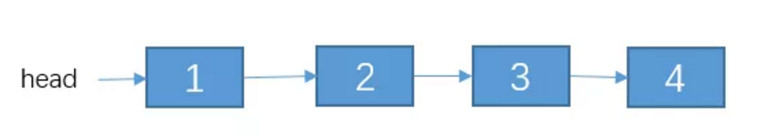
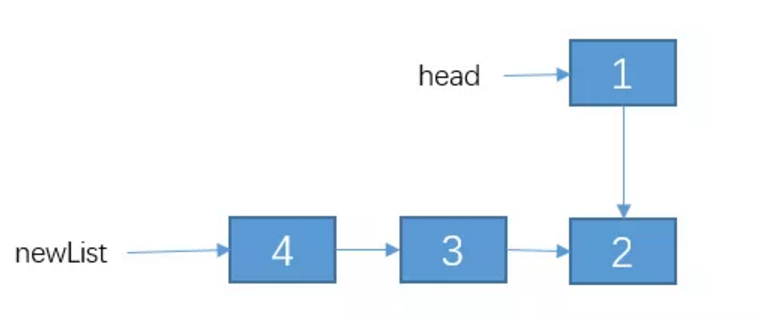

# 链表概述及基本应用

## 1 链表概述

用一组任意存储的单元来存储线性表的数据元素。一个对象存储着本身的值和下一个元素的地址。

- 需要遍历才能查询到元素，查询慢。
- 插入元素只需断开连接重新赋值，插入快。

## 2 基本应用

> 主要是对链表基本概念和特性的应用，如果基础概念掌握牢靠，此类问题即可迎刃而解

### 2.1 从尾到头打印链表

#### 题目

输入一个链表，按链表值从尾到头的顺序返回一个`ArrayList`。

#### 分析

- 链表的数据结构：`val`属性存储当前值，`next`属性存储下一个节点的引用。

- 遍历链表即不断寻找当前节点的`next`节点，直至`next`节点为`null`。
- 从尾到头顺序，使用一个队列来存储打印结果，每次从队列头部插入。（我觉得也可以使用栈来存储，用栈存储还需要一个一个pop出来存储，但麻烦）

#### 代码

```js
function printListFromTailToHead(head) {
  const array = [];
  while (head) {
    array.unshift(head.val);
    head = head.next;
  }
  return array;
}
```

### 2.2 反转链表

#### 题目

输入一个链表，反转链表后，输出新链表的表头。

#### 思路

1、递归

递归三要素：

- 定义递归函数的功能：反转链表
- 寻找结束条件：head.next == null 或空表
- 寻找等价关系，不断缩小参数范围

以下面例子为例



reverseList(head.next)可以得到下图，这是我们只需让head与head.next指针交换一下即可。



所以我们得到等价条件：

**reverseList(head)** 等价于 **reverseList(head.next）+ 改变一下1，2两个节点的指向** 。

写出递归式。

2、非递归

以链表的头部节点为基准节点

将基准节点的下一个节点挪到头部作为头节点

当基准节点的`next`为`null`，则其已经成为最后一个节点，链表已经反转完成

#### 代码

代码1

```js
//用递归的方法反转链表
var reverseList = function (head) {
    // 1.递归结束条件
    if (head == null || head.next == null) {
        return head;
    }
    // 递归反转子链表
    var newList = reverseList2(head.next);
    // 改变 1，2节点的指向。
    // 通过 head.next获取节点2
    let t1  = head.next;
    // 让 2 的 next 指向 2
    t1.next = head;
    // 1 的 next 指向 null.
    head.next = null;
    // 把调整之后的链表返回。
    return newList;
}
```

代码2

```js
var reverseList = function (head) {
  let currentNode = null;
  let headNode = head;
  while (head && head.next) {
    //获取基准点的下一个节点 将其作为头节点
    currentNode = head.next;
    //基准点的next指向头节点的下一节点，即越过current节点 
    //防止currentNode.netx丢失，即保留
    head.next = currentNode.next;
    //指向之间反转的链表
    currentNode.next = headNode;
    //headNode设置为已反转的链表
    headNode = currentNode;
  }
  //返回反转链表
  return headNode;
}
```

### 2.3 复杂链表的复制

#### 题目

输入一个复杂链表（每个节点中有节点值，以及两个指针，一个指向下一个节点，另一个特殊指针指向任意一个节点），返回结果为复制后复杂链表的head。

#### 思路

拆分成三步：

1.复制每一个节点，使得复制后的节点都在当前节点的下一个节点

2.原生链表的节点的指向任意节点，使复制的节点也都指向某一任意节点

3.重新连接节点，把原生节点重新连接起来，把克隆后的节点连接起来

#### 代码

```js
function Clone(pHead) {
    if (pHead === null) {
        return null;
    }
    //1.克隆节点，插在每个节点后面
    let current = pHead;
    while (current) {
        //复制节点
        var cloneNode = {
            label: current.label,
            next: current.next
        };
        current.next = cloneNode;
        current = cloneNode.next;
    }
    
    //2.克隆Random指针
    current = pHead;
    while (current) {
        //当前节点的下一个节点为克隆节点
        var cloneNode = current.next;
        //复制Ramdom指针
        if (current.random) {
            cloneNode.random = current.random.next;
        } else {
            cloneNode.random = null;
        }
        //移动到下一个原生节点
        current = cloneNode.next;
    }

    //3.将克隆节点连接起来，并还原原生链表
    var cloneNode = pHead.next;
    var cloneHead = cloneNode;
    //当前节点
    current = pHead;
    while (current) {
        //还原原生链表
        current.next = cloneNode.next;
         //移动到下一个原生节点
        current = cloneNode.next;
        //如果下一个存在
        if (current) {
            //连接克隆节点
            cloneNode.next = current.next;
            //克隆节点移动
            cloneNode = current.next;
        } else {
            //到达末尾
            cloneNode.next = null;
        }
    }
    //返回克隆链表
    return cloneHead;
}
```

### 2.4 删除链表中的节点

给定单链表的头指针和要删除的指针节点，在O(1)时间内删除该节点。

- 1.删除的节点不是尾部节点 - 将next节点覆盖当前节点
- 2.删除的节点是尾部节点且等于头节点，即只有一个节点 - 将头节点置为null
- 3.删除的节点是尾节点且前面还有节点 - 遍历到末尾的前一个节点删除

只有第三种情况时间复杂度是O(n)，且这种情况只会出现1/n次，所以算法时间复杂度是O(1)

```js
var deleteNode = function (head, node) {
    if (node.next) {
        node.val = node.next.val;
        node.next = node.next.next;
    } else if (node === head) {
        node = null;
        head = null;
    } else {
        node = head;
        while (node.next.next) {
            node = node.next;
        }
        node.next = null;
        node = null;
    }
    return node;
};
```

#### 2.4.1 删除链表中重复的节点

##### 方法1.存储链表中元素出现的次数

- 1.用一个map存储每个节点出现的次数
- 2.删除出现次数大于1的节点

此方法删除节点时可以使用上面总结的办法。

时间复杂度：O(n)

空间复杂度：O(n)

```js
function deleteDuplication(pHead) {
    const map = {};
    if (pHead && pHead.next) {
        let current = pHead;
        // 计数
        while (current) {
            //通过键获取值
            const val = map[current.val];
            //如果不为0则加一；否则等于1
            map[current.val] = val ? val + 1 : 1;
            //取下一个节点
            current = current.next;
        }
        //链表处理
        current = pHead;
        while (current) {
            //获取当前节点的值
            const val = map[current.val];
            if (val > 1) {
                // 删除节点
                console.log(val);
                if (current.next) {
                    current.val = current.next.val;
                    current.next = current.next.next;
                } else if (current === pHead) {
                    current = null;
                    pHead = null;
                } else {
                    current = pHead;
                    while (current.next.next) {
                        current = current.next;
                    }
                    current.next = null;
                    current = null;
                }

            } else {
                current = current.next;
            }
        }
    }
    return pHead;
}
```

##### 方法2：重新比较连接数组

链表是排好顺序的，所以重复元素都会相邻出现 递归链表：

- 1.当前节点或当前节点的next为空，返回该节点
- 2.当前节点是重复节点：找到后面第一个不重复的节点
- 3.当前节点不重复：将当前的节点的next赋值为下一个不重复的节点

```js
function deleteDuplication(pHead) {
    if (!pHead || !pHead.next) {
        return pHead;
    } else if (pHead.val === pHead.next.val) {
        let tempNode = pHead.next;
        while (tempNode && pHead.val === tempNode.val) {
            tempNode = tempNode.next;
        }
        return deleteDuplication(tempNode);
    } else {
        pHead.next = deleteDuplication(pHead.next);
        return pHead;
    }
}
```

递归分析：

1. 定义递归函数的功能：删除重复节点

2. 结束条件：节点为空和next为空

3. 等价表达式，缩小参数范围。

   pHead.next = deleteDuplication(pHead.next);

   return pHead

时间复杂度：O(n)

空间复杂度：O(1)

