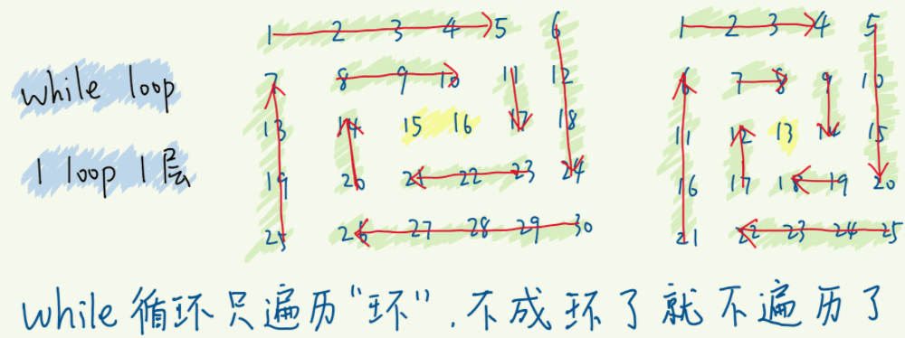
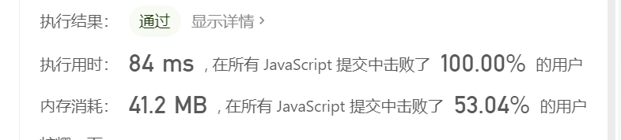
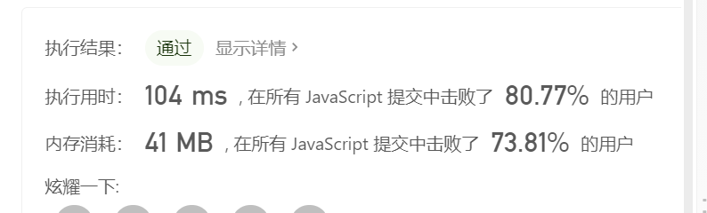

# 数组——二维数组

>建立一定的抽象建模能力，将实际中的很多问题进行抽象

## 1 构建乘积数组

### 题目

给定一个数组A`[0,1,...,n-1]`,请构建一个数组B`[0,1,...,n-1]`,其中B中的元素`B[i]=A[0]*A[1]*...*A[i-1]*A[i+1]*...*A[n-1]`。不能使用除法。

### 思路

`B[i]`的值是`A`数组所有元素的乘积再除以`A[i]`，但是题目中给定不能用除法，我们换一个思路，将`B[i]`的每个值列出来，如下图：


`B[i]`的值可以看作下图的矩阵中每行的乘积。

可以将`B`数组分为上下两个三角，先计算下三角，然后把上三角乘进去。

### 代码

```js
function multiply(array) {
    const result = [];
    if (Array.isArray(array) && array.length > 0) {
        // 计算下三角  计算前i - 1个元素的乘积
        result[0] = 1;
        for (let i = 1; i < array.length; i++) {
            result[i] = result[i - 1] * array[i - 1];
        }
        // 乘上三角（越过i） 计算后N - i个元素的乘积并连接
        let temp = 1;
        for (let i = array.length - 2; i >= 0; i--) {
            temp = temp * array[i + 1];
            result[i] = result[i] * temp;
        }
    }
    return result;
}
```

## 2 顺时针打印矩阵

### 题目

输入一个矩阵，按照从外向里以顺时针的顺序依次打印出每一个数字。

例如，如果输入如下4 X 4矩阵：

```text
1 2 3 4 
5 6 7 8
9 10 11 12 
13 14 15 16 
```

则依次打印出数字`1,2,3,4,8,12,16,15,14,13,9,5,6,7,11,10.`

### 思路

#### 解法1


借助图形思考，将复杂的矩阵拆解成若干个圈，循环打印矩阵，每次打印其中一个圈

设起点坐标为`(start,start)`，矩阵的行数为`rows`，矩阵的列数为`columns`

循环结束条件为 `rows>start*2` 并且 `columns>start*2`

将打印一圈拆解为四部，

- 第一步：从左到右打印一行
- 第二步：从上到下打印一列
- 第三步：从右到左打印一行
- 第四步：从下到上打印一列

最后一圈很有可能出现几种异常情况,打印矩阵最里面一圈可能只需三步、两步、甚至一步


所以在每一行打印时要做好条件判断:

能走到最后一圈，从左到右必定会打印

结束行号大于开始行号，需要从上到下打印

结束列号大于开始列号，需要从右到左打印

结束行号大于开始行号+1，需要从下到上打印

#### 解法2



​		如果一条边从头遍历到底，则下一条边遍历的起点随之变化。如果不遍历到底，可以减小横向和竖向遍历之间的影响。我选择一次迭代遍历一个“圈”，然后 4 条边的两端同时收缩，一层层向内处理，按顺时针依次遍历：上、右、下、左层。

​		当不再形成“环”了就结束遍历，剩下一行或一列，然后单独判断即可。

- 上边界 top : 0

- 下边界 bottom : matrix.length - 1

- 左边界 left : 0

- 右边界 right : matrix[0].length - 1

  矩阵不一定是方阵。top < bottom && left < right 是循环的条件。结束循环时，分 3 种情况：

- top == bottom && left < right —— 剩一行。

- top < bottom && left == right —— 剩一列。

- top == bottom && left == right —— 剩一项（也是一行/列）。

  处理剩下的单行或单列。因为是按顺时针推入结果数组的，所以：

- 剩下的一行，从左至右 依次推入结果数组。

- 剩下的一列，从上至下 依次推入结果数组。

### 代码

#### 解法1

```js
// 顺时针打印
function printMatrix(matrix) {
    var start = 0;
    var rows = matrix.length;
    var coloums = matrix[0].length;
    var result = [];
    if (!rows || !coloums) {
        return false;
    }
    while (coloums > start * 2 && rows > start * 2) {
        //打印圈
        printCircle(matrix, start, coloums, rows, result);
        start++;
    }
    return result;
}

// 打印一圈
function printCircle(matrix, start, coloums, rows, result) {
    //结束列号
    var entX = coloums - start - 1;
    //结束行号
    var endY = rows - start - 1;
    //从左向右打印
    for (var i = start; i <= entX; i++) {
        result.push(matrix[start][i]);
    }
    //结束行号>开始行号，从上到下打印
    if (endY > start) {
        for (var i = start + 1; i <= endY; i++) {
            result.push(matrix[i][entX]);
        }
        //结束列号>开始列号，从右往左打印
        if (entX > start) {
            for (var i = entX - 1; i >= start; i--) {
                result.push(matrix[endY][i]);
            }
            //结束行号>开始列号+1 从下到上。
            if (endY > start + 1) {
                for (var i = endY - 1; i > start; i--) {
                    result.push(matrix[i][start]);
                }
            }
        }
    }
}
```



#### 解法2

每个元素访问一次，时间复杂度 O(mn)*O*(*m**n*)，m、n 分别是行数和列数。空间复杂度 O(mn)*O*(*m**n*)。

“不撞南墙不回头法”。

```js
var spiralOrder = function(matrix) {
if (matrix.length == 0) return [];
  const res = [];
  //获得边界
  let top = 0;
  let bottom = matrix.length - 1;
  let left = 0;
  let right = matrix[0].length - 1;
  
  while (top < bottom && left < right) {
    //走到底
    for (let i = left; i < right; i++) res.push(matrix[top][i]);   // 上层
    for (let i = top; i < bottom; i++) res.push(matrix[i][right]); // 右层
    for (let i = right; i > left; i--) res.push(matrix[bottom][i]);// 下层
    for (let i = bottom; i > top; i--) res.push(matrix[i][left]);  // 左层
    right--;
    top++;
    bottom--;
    left++;
  }
  if (top == bottom) { // 剩下一行，从左到右依次添加
    for (let i = left; i <= right; i++) {
      res.push(matrix[top][i]);
    }
  } else if (left == right) { // 剩下一列，从上到下依次添加
    for (let i = top; i <= bottom; i++) {
      res.push(matrix[i][left]);
    }
  }
  return res;
};

```




