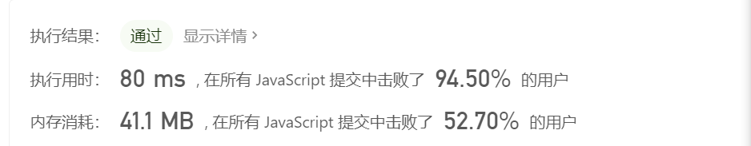
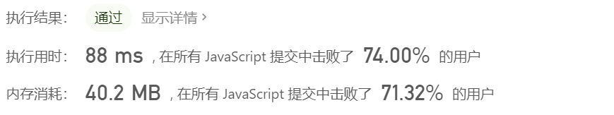
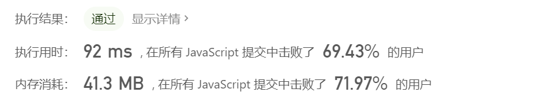
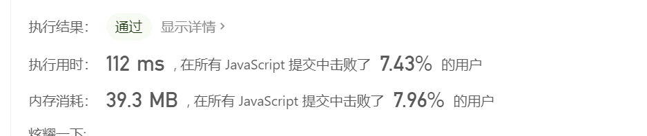
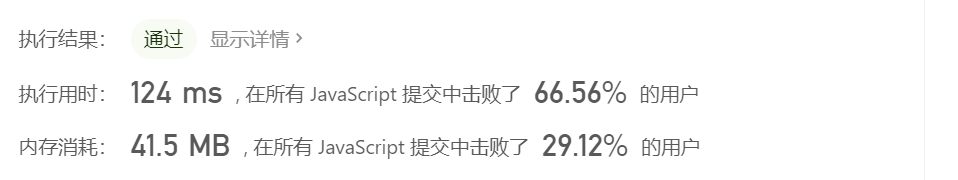

# 数组——数据统计

>数组少不了的就是统计和计算，此类问题考察如何用更高效的方法对数组进行统计计算。

## 数组中出现次数超过数组长度一半的数字

### 题目

数组中有一个数字出现的次数超过数组长度的一半，请找出这个数字。例如输入一个长度为9的数组{1,2,3,2,2,2,5,4,2}。由于数字2在数组中出现了5次，超过数组长度的一半，因此输出2。如果不存在则输出0。

### 思路

#### 解法1

map存储，开辟一个额外空间存储每个值出现的次数，时间复杂度最大为O(n)，逻辑简单。

```js
var majorityElement = function (nums) {
  if (nums && nums.length > 0) {
    var length = nums.length;
    var map = {};
    for (let i = 0; i < length; i++) {
      if (map[nums[i]]) {
        map[nums[i]]++;
      } else {
        map[nums[i]] = 1;
      }
      if (map[nums[i]] > length / 2) {
        return nums[i];
      }
    }
  }
  return 0;
};
```



**时间复杂度：O(n)**

**空间复杂度：O(n)**

#### 解法2

目标值的个数比其他所有值加起来的数多

记录两个变量 1.数组中的某个值 2.次数

1.当前遍历值和上一次遍历值相等？次数+1 ： 次数-1。

2.次数变为0后保存新的值。

3.遍历结束后保存的值,判断其是否复合条件

事件复杂度O(n) 不需要开辟额外空间 , 逻辑稍微复杂。

```js
var majorityElement = function (nums) {
  if (nums && nums.length > 0) {
    var target = nums[0];
    var count = 1;
    for (let i = 0; i < nums.length; i++) {
      if (nums[i] === target) {
        count++;
      } else {
        count--;
      }

      if (count === 0) {
        target = nums[i];
        count = 1;
      }
    }
    count = 0;
    for (let i = 0; i < nums.length; i++) {
      if (nums[i] === target) {
        count++;
      }
    }
    return count > nums.length / 2 ? target : 0;
  }
  return 0;
};
```



**时间复杂度O(n²）**

**空间复杂度O(1)**

## 连续子数组的最大和

剑指Offer42:[连续子数组的最大和](https://leetcode-cn.com/problems/lian-xu-zi-shu-zu-de-zui-da-he-lcof/)

### 题目

输入一个整型数组，数组里有正数也有负数。数组中的一个或连续多个整数组成一个子数组。求所有子数组的和的最大值，要求时间复杂度为`O(n)`

例如:`{6,-3,-2,7,-15,1,2,2}`,连续子向量的最大和为8(从第0个开始,到第3个为止)。

### 思路

记录一个当前连续子数组最大值 `max` 默认值为数组第一项

记录一个当前连续子数组累加值 `sum` 默认值为数组第一项

1.从数组第二个数开始，若 `sum<0` 则当前的`sum`不再对后面的累加有贡献，`sum = 当前数`

2.若 `sum>0` 则`sum = sum + 当前数`

3.比较 `sum` 和 `max` ，`max = 两者最大值`

```js
var maxSubArray = function (nums) {
  if (nums && nums.length > 0) {
    var sum = nums[0];
    var max = nums[0];
    for (let i = 1; i < nums.length; i++) {
      if (sum < 0) {
        sum = nums[i];
      } else {
        sum = sum + nums[i];
      }

      if (sum > max) {
        max = sum;
      }
    }
    return max;
  }
  return 0;
};
```



## 扑克牌中的顺子

剑指Offer61:[扑克牌中的顺子](https://leetcode-cn.com/problems/bu-ke-pai-zhong-de-shun-zi-lcof/)

### 题目

扑克牌中随机抽`5`张牌，判断是不是一个顺子，即这`5`张牌是不是连续的。

`2-10`为数字本身，`A`为`1`，`J`为`11...`大小王可以看成任何数字，可以把它当作`0`处理。

**示例 1:**

```
输入: [1,2,3,4,5]
输出: True
```

**示例 2:**

```
输入: [0,0,1,2,5]
输出: True
```

### 思路

- 1.数组排序 **排序时应使用numbers.sort((a, b) => a - b);，直接numbers.sort（）将不对最后一个元素进行排序**
- 2.遍历数组
- 3.若为`0`，记录`0`的个数加`1`
- 4.若不为`0`，记录和下一个元素的间隔
- 5.最后比较`0`的个数和间隔数，间隔数`>0`的个数则不能构成顺子
- 6.注意中间如果有两个元素相等则不能构成顺子

```js
var isStraight = function (numbers) {
  if (numbers && numbers.length > 0) {
    numbers.sort((a, b) => a - b);
    let kingNum = 0;
    let spaceNum = 0;
    for (let i = 0; i < numbers.length - 1; i++) {
      if (numbers[i] === 0) {
        kingNum++;
      } else {
        //间距
        const space = numbers[i + 1] - numbers[i];
        //如果存在相同数字，直接返回false
        if (space == 0) {
          return false;
        } else {
          //间距总和+=space-1
          spaceNum += space - 1;
        }
      }
    }
    //0的数量刚好能抵消间距 则true
    return kingNum - spaceNum >= 0;
  }
  return false;
}
```



## 第一个只出现一次的字符

剑指Offer:[第一个只出现一次的字符](https://leetcode-cn.com/problems/di-yi-ge-zhi-chu-xian-yi-ci-de-zi-fu-lcof/)

### 题目

在字符串 s 中找出第一个只出现一次的字符。如果没有，返回一个单空格。 s 只包含小写字母。

**示例:**

```
s = "abaccdeff"
返回 "b"

s = "" 
返回 " "
```

### 思路

#### 解法1

用一个`map`存储每个字符出现的字数

第一次循环存储次数，第二次循环找到第一个出现一次的字符。

时间复杂度`O(n)`、空间复杂度`O(n)`

```js
var firstUniqChar = function (s) {
  if (!s) {
    return " ";
  }
  const countMap = {};
  const arr = s.split("");
  for (let i = 0; i < s.length; i++) {
    let current = arr[i];
    let count = countMap[current];
    countMap[current] = count ? count + 1 : 1;

  }
  for (let i = 0; i < s.length; i++) {
    if (countMap[arr[i]] === 1) {
      return arr[i];
    }
  }
  return " ";
};
```


#### 解法2

使用`js`的`array`提供的`indexOf`和`lastIndexOf`方法

遍历字符串，比较每个字符第一次和最后一次出现的位置是否相同。

`indexOf`的时间复杂度为`O(n)`，所以整体的时间复杂度为O(n2)，空间复杂度为`0`。

```js
var firstUniqChar = function (s) {
  if (!s) {
    return " ";
  }
  for (let i = 0; i < s.length; i++) {
    if (s.indexOf(s[i]) === s.lastIndexOf(s[i])) {
      return s[i];
    }
  }
  return " ";
};
```

